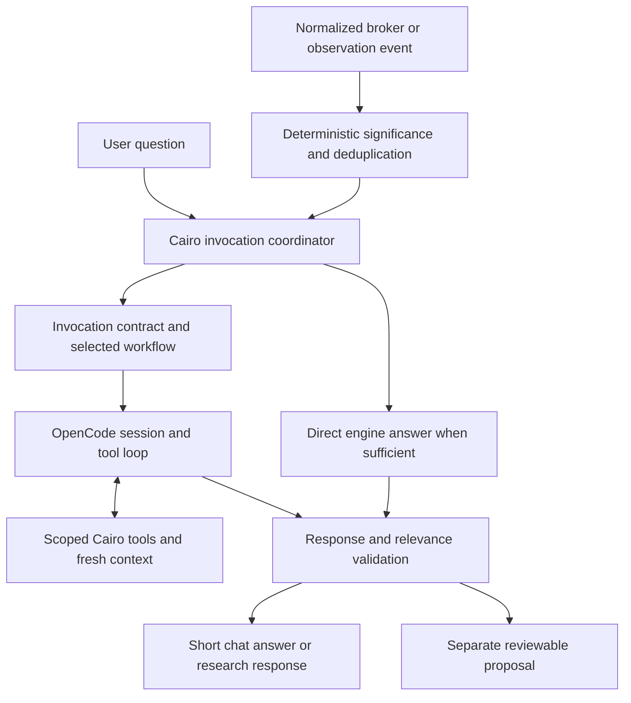

# Cairo AI chat architecture

Design proposal, October 5, 2026. This document describes proposed behavior; it
does not mean these components have been implemented or approved for execution.

The initial editable skill library and slash autocomplete are now implemented:
`manage-trade`, `set-stop-loss`, `set-targets`, and `bookmap-pattern`.
Bookmap tags and a side-filtered picker now route stop requests to pattern sources. See [Skill library](../SKILL-LIBRARY.md)
for usage and editing. The remaining coordinator, event routing and response-contract
changes below are still proposals.

## Decision

Keep the pinned OpenCode harness and the existing Cairo engine. Add a Cairo-owned
invocation coordinator between chat/events and OpenCode. Its job is to decide
whether to invoke AI, establish the question's scope, assemble an invocation
contract, select the workflow and context, and decide whether the returned result
is still relevant enough to publish.

An invocation should have an explicit purpose. A generic instruction to inspect
an account snapshot delegates too much product behavior to the model. Cairo
should specify what changed, what question requires interpretation, which position
and guidance apply, and what kind of response is permitted.

Start with one AI runtime, two session types, and a small library of workflows.
Introduce additional agents only when measured failures or independent workloads
justify them. Live trading should not acquire an extra model call simply to route
every message.

## Existing implementation

- `CopilotChat` owns one session, command deduplication, streaming, cancellation,
  and transcript recovery. User questions use `session.prompt`.
- `CopilotWaker` is opt-in. It hashes account/recommendation/observation summaries,
  coalesces changes, waits while chat is busy, and spaces dispatches by 15 seconds.
  It sends machine observations using `session.synthetic`, with no approval grant.
- `TradingContext` refreshes bounded engine facts before model steps. Its current
  response-style instruction asks for brief live replies and longer research replies.
- `cairo-plugin` restricts tools to Cairo domain operations. The engine owns source
  freshness, position guidance, recommendations, tickets, and broker execution.
- The UI renders model text directly. There is no explicit chat mode or validated
  response contract yet.

Current limitations: one session combines research, user questions, and events;
the event prompt is generic; pending changes are represented by one latest summary;
brevity is advisory; raw text can appear before result validation. Some context
instructions also retain earlier milestone descriptions of Bookmap/approvals that
need to be reconciled with the engine's actual capabilities.

## Ownership and flow



OpenCode remains responsible for provider transport, durable conversation state,
tool iteration, interrupts, and runtime event streaming. Cairo owns account and
position scope, event significance, invocation policy, workflow selection,
publication, and all broker authority. A skill never grants additional authority.

## Invocation contract

Persist a typed envelope before dispatch. Fields should include:

```ts
interface Invocation {
  invocationId: string
  dedupeKey: string
  origin: "user" | "broker-event" | "observation-event"
  mode: "live" | "research"
  intent: "rule-question" | "position-review" | "event-review"
    | "strategy-research" | "proposal-request" | "unknown"
  question: string
  scope: {
    accountId: string | null
    symbol: string | null
    positionId: string | null
    guidanceRevision: number | null
  }
  triggerEventIds: string[]
  baseline: {
    runtimeInstanceId: string
    brokerFactsRevision: number | null
    preparationRevision: string | null
  }
  workflow: { id: string; version: string }
  allowedOperations: string[]
  outputContract: "live-answer-v1" | "research-answer-v1"
  deadlineAt: string | null
  policyVersion: string
}
```

This is a conceptual schema, not a claim about currently supported OpenCode fields.
The trusted envelope lives in Cairo. Put correlation IDs in OpenCode metadata,
and inject the active contract through the plugin context hook. Do not trust
account IDs or invocation IDs supplied only in model-authored text.

State transitions: created -> queued -> admitted -> running -> completed ->
published. Other outcomes include suppressed, expired, superseded, canceled,
failed, and delivery-uncertain. Record admission separately from completion.
Uncertain delivery requires session inspection; never blindly resend the same job.

## Mode and scope selection

Use a visible Live / Research control, with Live as the default. Automatic trading
events always use Live. An explicit request to explain or research may override
response depth for that question. This does not change broker permissions.

Resolve the target from explicit user wording, the focused position, and the
selected account. When those disagree or several positions match, ask one short
clarifying question. A strategy-rule question can be answered without current
holdings if clearly identified as rule recall; a position-specific answer requires
position scope and applicable attached guidance.

Choose workflows using known UI actions and typed event kinds first. A small
classifier may help with ambiguous research requests later, but its result must
be validated against supported intents. Never let a classifier select an account,
grant authority, or convert a draft research rule into active guidance.

## User-question path

1. Capture the original text and the mode selected for this invocation.
2. Resolve scope and distinguish rule recall, current-state interpretation,
   research, and an explicit request for a proposal.
3. If Cairo already has an approved concise rule or an exact account fact that
   answers the question, use a deterministic answer template. Do not manufacture
   a concise rule by truncating arbitrary prose.
4. Otherwise select a workflow, relevant clauses, and scoped evidence.
5. Invoke OpenCode and permit only the operations required for the task.
6. Validate the result, check relevant state changes, and display the answer.

Example: "After entering this short, where is my stop?" targets the focused short
position and its frozen guidance. If its reviewed clause is "mini bounce high
after short bid breakdown", the preferred display is that concise wording.
An explicit before/after distinction must be preserved. The system must not add a
price or choose between alternative rules without evidence.

## Automatic-event path

Normalize source changes into typed events before considering an AI call. Store
event identity, account, symbol, position/order identity, previous/new values,
source time, receipt time, coverage, and any causal ticket/command identity.

An order acknowledgement is not a fill. A quantity change is not proof of its
cause. Broker reconciliation establishes those facts; the model interprets the
consequence of confirmed facts under the attached guidance.

| Event | Default handling |
| --- | --- |
| Repeated identical poll or reconnect snapshot | Update state; no AI invocation |
| Routine accepted-order acknowledgement | Deterministic status update |
| Confirmed new position or partial fill | Invoke review only if guidance interpretation is needed |
| Confirmed position closure | Deterministic closure notice; optional review after trading |
| Protection rejected, canceled, or uncertain | Immediate engine-owned notice; optional AI explanation |
| Fresh eligible pattern relevant to reviewed guidance | Scoped review if source prerequisites are satisfied |
| Unknown/replay Bookmap mode or stale data | Context only; cannot establish a live trigger |

Event prompts should name a specific question. For a confirmed partial close:
"The confirmed position quantity changed from 100 to 75. Review the consequence
under attached guidance revision N. Return one short update only if human review
is needed. Otherwise return no-change. Do not create a new rule or submit an order."

Coalesce noisy updates by account/position, retaining event IDs and causal order.
Never drop fills, rejection transitions, or unresolved outcomes because a later
poll replaced the summary. A hash of a canonically ordered snapshot detects
changes; it does not by itself establish event significance or causation.

Automatic AI updates remain opt-in. Preserve the existing cancellation and
uncertain-delivery pauses. Silence is a successful output when no material change
requires the trader's attention. Suppress repeated notices for the same event
and guidance revision.

## Context construction

Separate five sources:

1. Core instructions: grounding, brief communication, and authority boundaries.
2. Invocation contract: purpose, target, mode, permitted operations, and output.
3. Selected skill: the repeatable procedure for that purpose.
4. Reviewed strategy clauses and attached guidance: versioned domain data.
5. Scoped observations: timestamps, coverage, identities, and relevant recent history.

User preparation, strategy prose, broker messages, and research documents are data.
They must not overwrite system instructions or expand tool access. Keys and full
credential files never enter model context.

Refresh evidence before each tool/model step, while keeping the invocation's
identity and purpose stable. If the focused position changes, do not silently
retarget an already running job. Replace oversized full-account snapshots with
targeted reads. Request chart details only when the question needs them.

Retain the relevant conversation turns and references for follow-up questions.
Do not reinsert every archived event into every prompt. Source times, broker
coverage, and attached guidance revisions remain authoritative over chat memory.

## Skills versus other mechanisms

Skills are reviewed, reusable procedures. Strategies are versioned user rules.
Prompts specify role and output behavior. Tools provide operations. Code enforces
identities, calculations, source eligibility, approvals, and dispatch decisions.

Additional skill candidates:

| Skill | Repeatable procedure | Result |
| --- | --- | --- |
| `answer-position-rule` | Resolve position, read attached clause, preserve qualifiers | Brief rule answer or essential clarification |
| `review-position-event` | Compare confirmed before/after facts against attached guidance | Material update, review request, or silence |
| `assess-observation` | Read source eligibility and reviewed pattern clauses | Contextual interpretation without invented live confirmation |
| `prepare-trading-notes` | Organize scenarios and identify missing discretionary conditions | Reviewable preparation draft |
| `research-strategy` | Compare supplied evidence, assumptions, alternatives, and limitations | Detailed research with source references |
| `draft-guidance` | Translate reviewed narrative into supported predicates; preserve unknown clauses | Draft requiring explicit review |
| `explain-ticket` | Read an existing exact ticket and explain its effect | Brief explanation linked to that ticket |

Each skill should specify its trigger, required evidence, steps, allowed operations,
missing-evidence behavior, output contract, examples, and version. Mandatory
workflows are selected by Cairo and supplied explicitly. Optional discovery can
be added for research later. The initial library's explicit native attachments,
composition and reload behavior are tested against pinned OpenCode 2.0.22.

Skills should not implement quantity arithmetic, token rotation, broker submission,
deduplication, or freshness checks that the engine can enforce. Research skills
may propose edits; they do not activate position guidance.

## Response contracts and presentation

For Live, use a short answer, structured support state, evidence references, and
optional separately requested detail. Example:

```json
{
  "disposition": "answer",
  "answer": "Mini bounce high after short bid breakdown.",
  "details": null,
  "support": "rule-only",
  "evidenceRefs": ["attached-guidance:position-123:revision-4:stop-clause"],
  "proposalId": null
}
```

Allow dispositions answer, clarify, no-change, and proposal. Aim for 3-12 words,
with a 20-word maximum for the live answer. A brief essential clarification or
uncertainty is preferable to a confident unsupported answer. Research uses a
separate contract with narrative, evidence, assumptions, and optional proposals.

A concrete way to enforce publication while retaining OpenCode is a domain tool
such as `submit_response`, whose executor validates a bounded structured object
against the active invocation. Treat it as submitting a candidate, not directly
publishing. Raw assistant prose must not bypass the validator. This avoids assuming
that native structured-output options automatically survive every harness/provider
combination. Provider-level schema output is an alternative after integration tests.

For Live, show a lightweight working indicator, then an atomic validated answer.
Do not stream raw JSON or a long unvalidated explanation onto the trading screen.
Research may show progress and streamed prose, clearly marked as provisional until
complete. Keep proposal cards separate from conversational answers.

Check schema, length, valid evidence references, target identity, permitted proposal
type, and applicable source prerequisites. Recheck evidence dependencies before
publishing: an unrelated account update need not invalidate a rule-recall answer,
but a changed target quantity invalidates a quantity-dependent proposal.

Reference validation cannot prove every natural-language claim. Deterministic
rendering of reviewed clauses, semantic evaluations, and trader feedback remain
necessary. Never fix an overlong answer by cutting a sentence mid-condition.
For an overlong but otherwise valid candidate, permit one bounded formatting repair
or offer the longer text as detail; do not automatically rerun trading actions.

## Sessions, concurrency, and latency

Use separate research sessions and live sessions scoped to the selected account.
Position scope lives on each invocation; it does not require one session per
position initially. Share reviewed strategies and engine facts, not whole transcripts.

Prioritize typed user questions over automatic interpretation jobs. Coalesce pending
event reviews and supersede outdated ones. If an event job blocks a user question,
interrupt only a read-only interpretation after resolving its admission state.
Do not interrupt through an uncertain action/tool boundary. Engine monitoring and
deterministic notices continue independently of model work.

Deadlines govern publication and retry policy, not market truth. If a live result
expires, discard its recommendation and return a short status rather than silently
switching models. Retain late results for diagnosis if appropriate. Measure model
reasoning, tool latency, and time to validated answer separately; output brevity
alone does not guarantee low latency.

Start with the selected GPT-6.1 Sol model. Tune reasoning and tool budgets by
workflow after measurement. Do not create a second model call for routine routing
or a second agent to summarize every live answer. The deterministic path should
answer reviewed rule recall and exact status questions without model latency.

## Actions and approvals

Event observations and model text are never approvals. Existing exit-ticket
preflight, exact human approval, recovery checkpoints, and reconciliation remain
engine-owned. The new coordinator adds purpose-scoped tool access; it does not
replace those controls.

Default event reviews are read-only. A model may identify a need for review.
Staging an actionable ticket should require an explicit authorized proposal
workflow, or a separately enabled product policy that is reviewed in its own
right. Skill text cannot enable that policy.

## Measurement and tests

Record invocation ID, source/event IDs, scope, workflow and prompt versions,
model/settings, evidence revisions, tool calls, candidate output, validation
outcome, suppression reason, latency, and available usage. Keep traces local by
default and redact credentials. Store concise evidence summaries, not private
model reasoning. Link feedback and regression cases to invocation IDs.

Build a representative evaluation set from real user questions and sanitized
event scenarios. Score correctness and qualifier preservation before brevity.
Include ambiguous position scope, rule recall without a current holding, missing
guidance, stale snapshots, replay/unknown observations, partial fills, acknowledgements
without fills, rejection transitions, out-of-order events, and superseded results.

Run deterministic tests for event routing, correlation, approvals, and publication
gates; pinned-runtime tests for user and synthetic message paths; and periodic
model evaluations for answer quality. Track notification precision, missed material
events, clarification quality, research depth, answer length, and latency percentiles.
Evaluate model/prompt/skill upgrades before making them the default.

## Implementation sequence

1. Reconcile existing context instructions with actual capabilities. Add explicit
   modes, invocation IDs/contracts, and a shared coordinator for user and event paths.
2. Add scoped context, two session types, response contracts, and publication gating.
3. Replace generic fingerprint wakeups with typed event deltas and suppression rules.
4. Extract the first skills: position-rule answers, position-event reviews, research.
5. Add traces, representative evaluations, and measured latency tuning.

Suggested modules: `InvocationCoordinator`, `InvocationStore`, `IntentRouter`,
`EventNormalizer`, `EventPolicy`, `ContextBuilder`, `SkillCatalog`, `ResponseValidator`,
`ResponsePublisher`, and `InvocationTrace`. These are application policy modules
around the existing harness, not another agent execution framework.

## OpenCode integration detail

Both user and machine origins must enter the Cairo coordinator. User dispatch
continues through `session.prompt`; event dispatch continues through
`session.synthetic` where appropriate. OpenCode's prompt-admission hook does not
run for synthetic messages. Therefore mandatory scope, workflow, and permissions
must not be installed only in that hook. The context hook reads the trusted active
invocation for the session before each model dispatch, including event-driven runs.

Pin API behavior to the installed 2.0.22 types and tests. Current online documentation
is guidance rather than a substitute for that compatibility check.

## Sources

- [OpenCode plugin hooks](https://opencode.ai/v2/docs/build/plugins/): prompt admission,
  synthetic-message distinction, context hooks, and domain transforms.
- [OpenCode skills](https://opencode.ai/v2/docs/skills): reusable instructions and skill loading.
- [OpenAI agent evaluation guidance](https://developers.openai.com/api/docs/guides/agent-evals):
  trace inspection followed by repeatable datasets and evaluation runs.
