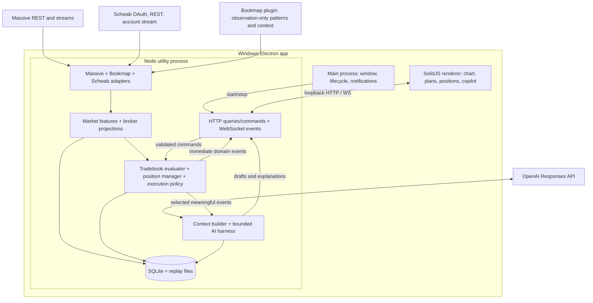

# Cairo MVP architecture

Status: proposed implementation design. October 4, 2026. Cairo means copilot, AI, route.

Read [research](RESEARCH.md) for inspected sources, [MVP specification](MVP-SPEC.md) for behavior/contracts, and [implementation plan](IMPLEMENTATION.md) for ordered work packages.

## 1. Product decision

Build a local Windows trading workstation in TypeScript, using SolidJS, Electron, Lightweight Charts, Massive market data, a Bookmap observation adapter, Schwab connectivity, and OpenAI inference.

Its central artifacts are a **versioned reusable tradebook** and a **versioned daily trading plan** that binds that tradebook to a symbol, levels, sizing, and management. Trader and AI develop the tradebook together; a deterministic runtime watches its executable rules; Bookmap supplies order-flow pattern observations; Schwab supplies actual positions/orders/fills. Every alert, order intent, and recommendation refers to those versions and the evidence available at the time.

The first useful release prioritizes:

1. Detecting tradebook-defined entries using Bookmap events or candle rules.
2. Managing an actual Schwab position against tier-specific stop, target, and invalidation rules.
3. Supporting observer, assistant, and automated-management modes, with bounded AI interpretation alongside deterministic execution policy.

US stocks, Schwab connectivity, Bookmap-based personal trading, flexible collaborative tradebooks, and all three modes are confirmed. Default new sessions to observer. Assistant submits reviewed orders. Automated mode defaults to assistant entries and automation only for the management rules the user explicitly arms for that position. The 1-minute opening-range breakout is a portable candle-based example, not a replacement for the user's Bookmap tradebooks.

## 2. MVP scope

| Workflow | First release | Follow-on |
| --- | --- | --- |
| Premarket preparation | Collaboratively import/create a reusable tradebook, then bind a daily plan: levels, entry window, stop, targets, constraints | News/catalyst research, broader scanning, richer daily prep |
| Live signal detection | Existing Bookmap pattern observations plus contextual tradebook rules; 1-minute ORB example; deterministic evidence and alerts | New tested detectors and composite patterns |
| Trade management | Schwab fills/orders; configurable logical tiers with a scalp/core/runner preset; observer advice, approved order actions, and armed deterministic automated exits | Broader order types and more discretionary management interpretations |
| Journaling | Persist fills, plan versions, signals, management events, user notes; simple daily/trade review | Rich journal editor, screenshots, analytics |
| Research/backtesting | Record replayable inputs; replay a captured session without orders or LLM calls | Historical bar backtests, strategy comparison, parameter experiments |

Initial workload: one primary Bookmap focus symbol, a small candle watchlist, one Schwab account, a few active positions. This is a design target for testing, not an architectural limit or a claim of measured capacity.

Explicitly defer cloud services, multi-user login, shared accounts, distributed workers, a broker marketplace, automatic updates, a plugin framework, vector databases, unrestricted generated strategies, options/futures, and macOS/CLI product packaging. Keep boundaries portable so macOS and a CLI do not require replacing the trading core.

## 3. Stack decisions

| Layer | Decision | Reason |
| --- | --- | --- |
| Language | TypeScript, strict mode, ESM | Matches current OpenCode and most reusable ViteApp code |
| Desktop | Electron | Current OpenCode desktop uses it; Windows packaging and browser charts are straightforward |
| Renderer | SolidJS + Vite through electron-vite | Matches OpenCode's UI model; imperative chart APIs fit a thin component wrapper |
| Styling | Small CSS theme/token set | Trading UI needs legibility and density before a large component system |
| Runtime | Node supplied by Electron utility process | Feed/broker ownership survives renderer reloads; no separate installed backend runtime |
| Development | Bun workspaces/package management; TypeScript build tooling | Similar workflow to OpenCode. Production code must not assume Bun globals |
| Local API | Hono + Node adapter; HTTP commands/queries, one WebSocket event stream | Clear headless boundary, inspectable interfaces, easy future CLI client |
| Validation | Zod schemas at external boundaries; inferred TypeScript types | Shared contracts and explicit domain validation |
| Storage | SQLite via `node:sqlite`; raw replay inputs in rotating NDJSON files | Local persistence with minimal dependencies; verify packaged-runtime support first |
| Charting | Official `lightweight-charts`, verified/pinned 5.x | Reuses the existing JavaScript chart approach; avoids the legacy wrapper |
| Model API | Official `openai` TypeScript SDK, Responses API | One provider, structured results, tools, streaming; no provider framework needed initially |
| Tests | Vitest for pure/runtime fixtures; a small Electron/Playwright smoke suite | Test trading state and failure behavior, then verify the packaged Windows path |

Pin compatible stable versions in a lockfile during implementation. OpenCode's current versions are evidence, not a dependency manifest to copy. Use a standalone development Node version compatible with Electron's embedded Node. The M0 packaging check decides whether `node:sqlite` is available; if not, use one explicitly documented SQLite adapter rather than redesigning the application.

### Considered alternatives

Tauri is feasible, but it introduces Rust/native packaging and differs from the current OpenCode desktop. React is also feasible, but matching SolidJS is a reasonable choice for this greenfield repository. Electron's extra disk/RAM footprint is acceptable for this personal Windows MVP.

A direct IPC-only API would eliminate a local HTTP layer. Choose HTTP + WebSocket here because headless reuse and a future CLI are part of the desired direction. Keep IPC limited to desktop bootstrap and native actions; do not duplicate domain commands across IPC and HTTP.

For the harness, start with a small custom Responses loop. The [local Agents SDK](https://developers.openai.com/api/docs/guides/agents/sdk) can replace that loop later. A graph framework, multiple specialist agents, or a hosted managed coding harness does not remove the need to implement Cairo's market/position state machines. Introducing them now makes the first handoff harder without solving the central problem.

## 4. Process and package boundaries



The backend runs while the app is open, including when its window is minimized. Closing the app stops monitoring; it is not a Windows service. Renderer refresh or symbol changes must not restart broker/market streams. Desktop notifications are requested through the main process so critical alerts can still appear while minimized.

Proposed implementation layout (directories are not created by this planning task):

```text
cairo/
  apps/desktop/
    src/main/                 # Window, runtime lifecycle, native notifications
    src/preload/              # Bootstrap/native API only
    src/renderer/             # Solid app and ChartView wrapper
    src/runtime-entry.ts      # Utility-process entry; Node only
  packages/contracts/         # DTOs, Zod schemas, event/command types
  packages/core/
    market/                   # Candle cache, clock, features, quality
    tradebooks/               # Narrative + rule graph + detector registry
    plans/                    # Daily bindings, validation, immutable versions
    signals/                  # Setup state machines, evidence, deduplication
    positions/                # Lifecycle, fill projection, risk/management rules
    journal/                  # Timeline and factual trade summary
    ports/                    # Clock, broker, market data, repositories
  packages/runtime/
    providers/massive/        # REST, AM/T/Q, vendor mapping
    providers/schwab/        # OAuth, account reads, account activity
    providers/bookmap/       # Observation bridge, mode/readiness, alias mapping
    execution/               # Approved intents, policy checks, Schwab writes
    services/                # Startup, subscriptions, refresh jobs, publication
    storage/                 # SQLite migrations/repositories, replay writer
    server/                  # Hono routes, WebSocket, snapshot bootstrap
  packages/ai/
    provider/                # OpenAI Responses adapter
    harness/                 # Run loop, tool dispatch, budgets, cancellation
    context/                 # Snapshot construction and retrieval
    tools/                   # Read tools and proposal tools
    prompts/                 # Versioned tradebook/planner/monitor/manager/review instructions
  fixtures/                  # Synthetic and redacted captured inputs
  docs/                      # These plans
```

`core` imports no Electron, browser DOM, network, SQLite, OpenAI, or ViteApp globals. `contracts` imports no runtime code. `runtime` owns mutable market/account state and persistence. `ai` uses explicit read/proposal ports; it does not write directly into broker state. The renderer is a projection and command producer, not the trading engine.

Do not create separate packages for every feature or bring in Turbo just because OpenCode uses a larger monorepo.

## 5. Market-data design

### One canonical candle source

Use Massive REST minute aggregates for initial history and Massive `AM` for live minute candles. Both normalize to the same `Bar` model. Upsert by symbol + interval + start timestamp; an aggregate message replaces that interval's values. Never add the volume of repeated aggregate messages.

Use `T` for eligible last-trade observations and intrabar proximity/crossing evidence, and `Q` for spread/estimated liquidation-price information when entitled. Do not independently build another OHLCV series from `T` in the first release. This keeps chart and rule-engine candle data aligned and avoids mixing aggregate volume with trade volume. Implement `AM` first; add `T/Q` before the live-management acceptance milestone.

Schwab quotes are an explicitly labeled fallback if Massive quotes are unavailable. Preserve their source and timestamp; do not switch sources invisibly. Massive remains the primary candle source; Schwab remains the account/order source.

Subscribe only to watchlist symbols and held-position symbols, including positions opened outside Cairo. A symbol with a position stays subscribed after removal from the watchlist.

### Historical/live handoff

1. Authenticate the socket, subscribe, and buffer incoming events for a loading symbol.
2. Fetch complete recent minute history with all pages. Fetch a small daily reference window for prior-session levels, not three years by default.
3. Separate completed historical intervals from the current interval. A current REST candle is provisional, not an extra candle to sum into.
4. Install the historical cache, then apply buffered live aggregates in observed order. Later live values replace overlapping REST values.
5. Start evaluation only after the symbol is initialized. History can initialize setup context; it cannot emit historical entry alerts as fresh live alerts.
6. On reconnect, resubscribe and REST-backfill the missing minute range. Restore state but suppress entry alerts for events known only through backfill. Emit a data-restored summary and resume on fresh live evidence.

Keep event time and receive time separately. Live decision ordering follows local observation order, not retrospectively sorted exchange timestamps. Provider corrections can change the chart/next calculations without erasing the original alert evidence.

### Features and trading clock

First features: prior close/high/low, premarket high/low, session VWAP, last closed 1m/5m candle, 1-minute opening-range high/low/readiness, current eligible trade, valid bid/ask spread, and distance to configured plan levels. Rolling relative-volume/ATR can follow when a selected tradebook needs them.

Define the VWAP anchor explicitly, defaulting to the regular session for the starter templates. Compute from bar VWAP times volume divided by volume for included intervals; label a fallback estimate if bar VWAP is absent. Premarket-inclusive VWAP is a separate feature. A closed-bar rule uses VWAP as of that closed interval, not a later forming-bar value.

Keep UTC epoch milliseconds in core models; use Eastern exchange dates/session windows and DST-aware conversion. Use provider status/holiday/early-close data for live session boundaries. A manually selected historical replay date supplies its own stored session calendar. No hardcoded UTC offset.

Bar close means **Cairo's evaluation watermark**, not a provider promise of finality: first evaluate after interval end plus a configurable small grace, initially 2 seconds. Late arrivals/corrections update the cache and future features, record a revision, and do not retroactively generate a new live entry. Missing no-trade intervals are gaps, not fabricated zero-volume OHLC bars. The fake clock must drive closes even when no next trade arrives.

### Quality as product state

Each symbol exposes feed capability, connection state, latest receive time, latest price/quote time, history readiness, and gap status. A delayed feed is explicitly labeled delayed. It can support charts/research but cannot be presented as real-time signal monitoring.

Missing input evaluates as `UNKNOWN`, not false, zero, or last-known indefinitely. Quote validity and quote age are separate from socket health. Initial freshness windows are configurable engineering defaults, not financial rules: 5 seconds for a price-trigger input, 5 seconds for a liquidation quote, and 90 seconds for a relevant completed minute during an active/liquid symbol. Quiet symbols and halts need a distinct "no recent event" state. Feed-wide failure pauses new entry evaluations; position cards keep the last state with visible uncertainty and deterministic data-loss notifications.

### Bookmap is a first-class observation source

Keep the Bookmap desktop heatmap as the order-flow visualization for the MVP. Cairo displays pattern/evidence cards, current important wall context, and linked time/price markers alongside its candle chart. Rebuilding a full Bookmap heatmap is unnecessary for first delivery; candle markers alone also cannot explain a wall pattern. On-demand Bookmap screenshot attachments can supplement discussion, but do not replace a reliable event feed.

The existing Java detector handles eight pattern types and scores in event time. Reuse it as a provider. Add a small observation-only extension in `bookmap-plugin` during the later implementation work; all new Cairo application code remains TypeScript. First implement JSONL export from its existing serializable signal objects and observer/replay ingestion, then provide a live observation stream containing readiness, live/replay/unknown mode, heartbeat, instrument metadata, pattern episode updates, and the wall/context evidence needed by the selected rules. The inspected plugin does not already implement that JSONL writer.

Do not mistake signal serialization or the future log for a live WebSocket API. Extend the existing plugin or provide an isolated observation companion that reuses its detector. It must not route pattern observations into the plugin's native order manager. Cairo is the Schwab execution route for Cairo-managed trades; configure the existing plugin as observations only for that workflow.

Cairo sends a small observation subscription/configuration: symbol, supported pattern IDs, relevant levels/zones, detector thresholds, and tradebook/config version. This must be independent of native execution trade-button configuration. Existing engine eligibility is tied to enabled tradebooks, so simply exporting badges while leaving native config unrelated is insufficient. Preserve the detector's display-only behavior and add a distinct observation output path.

Each pattern requirement exposes whether it can be observed with available data. Missing Bookmap connection/readiness blocks only Bookmap-dependent rules; candle-only ORB continues. Pattern score is a quality index, not a model probability. Map aliases explicitly, keep nanoseconds as decimal strings, and convert price ticks to real prices once inside the Java adapter. A replay or unknown-mode event may be displayed/reviewed but never authorize a live broker action.

For management beyond an emitted pattern (for example, a protective bid disappearing), add versioned wall-qualified/cleared/reappeared/removed/context observations or a dedicated tested detector. Until then, that particular condition stays human-confirmed. Do not infer it from a generic opposite-direction badge.

## 6. Schwab integration

Connect via the user's existing Schwab application credentials and registered redirect URI. Open authorization in the system browser; for the first private MVP, paste the callback URL into Cairo, as the existing code can exchange its authorization code. Automated callback capture is optional later. Refresh according to returned expiry, persist rotated tokens, and show an actionable reconnect state when reauthorization is needed.

Read/select one account explicitly. Persist its account hash for API addressing. Startup loads positions, working orders, and enough order/fill history to reconstruct the current trading day, including still-working orders entered earlier. Do not use ViteApp's first-account shortcut or assume all relevant orders were entered today.

Use Schwab `ACCT_ACTIVITY` as a prompt to refresh the authoritative REST account/order projection. Coalesce bursts; initially poll every 15 seconds while connected and refresh promptly on activity. Retain raw order status and nested parent/child relationships. Deduplicate execution legs across repeat reads and partially filled/canceled/replaced order trees. Credentials and vendor payloads stay out of model context.

Positions and orders are broker facts. Plans and proposed stops are Cairo intent. Show both:

- **Planned stop/targets**: from the attached management plan.
- **Broker working stop/targets**: from orders, with status and remaining quantity.
- **Protection discrepancy**: a factual difference, not proof that an alert or an AI proposal placed an order.

A preexisting position can be tracked immediately using broker quantity/average basis, but historical entry/risk/journal details may be unknown. Ask the user to attach a plan and initial stop for R-based management. A fill does not automatically prove which signal caused the trade: auto-attach only an unambiguous active plan for that symbol/direction; otherwise present a choice. Preserve the original attachment for later review.

Do not synchronize credentials or execution state with ViteApp/Bookmap. For the first adapter validation, run Cairo as the active Schwab streaming client; document how the user's existing app's streamer behaves before assuming simultaneous sessions are supported.

### Three execution modes

| Mode | Entry | Exit/stop/target actions | AI role |
| --- | --- | --- | --- |
| Observer | Signal/recommendation only | Alerts/proposals only | Explain, critique, draft |
| Assistant | User approves a concrete ticket | User approves a concrete ticket | Propose; never directly submit |
| Automated | Assistant entry by default | Named deterministic management rules execute after being armed | Explain results; propose policy changes for review |

Policy is attached to a tradebook/plan/position, not merely a global toggle. It names allowed actions, tier quantities, price/size limits, and required data. A mode change never retroactively grants an old proposal permission to execute. Observer is the default after restart; automated management requires an explicit resume of the saved policy after account/feed recovery. Broker-hosted protective orders continue according to broker behavior while Cairo is offline.

Execution flow: evidence-backed intent -> mode/policy decision -> ticket review if required -> revalidate current quantity/orders/prices -> deterministic order payload -> submit once -> retain broker response/status -> refresh account -> confirm fills through broker facts. A submit timeout is unknown, not permission to retry an order blindly. Repeated episode updates and repeated HTTP/UI commands refer to the same intent and cannot create duplicate orders.

Limit the initial writer to equity entries with tested bracket payloads, partial/full closing actions, and explicitly supported protective-order replacements/cancels. Match actual order trees before replacing protection; never leave an existing full-size stop/OCO working while adding a separate full-size closing action that can oversell. Unknown order arrangements require an assistant ticket/manual review rather than speculative automated changes.

Serialize Cairo execution commands per account/symbol. Reserve quantities for pending and accepted intents until broker reconciliation, so two local rules cannot both close the same shares while REST still shows the older quantity. Track OCO siblings as alternatives within their order topology. Outside broker actions can still race with Cairo; reconcile them and pause ambiguous arrangements rather than claiming the local queue controls every Schwab client.

This is basic order/position correctness for private use, not a distributed coordination or security framework. Test partial fills, OCO quantities, replacement results, and unknown submissions through fixtures before live use.

## 7. The trading harness

### Two cooperating loops

**Market loop:** incoming market/Bookmap/account updates -> normalize -> update features/positions -> evaluate armed tradebook and management predicates -> save evidence/events -> immediately publish alerts and allowed deterministic action intents.

**Copilot loop:** user request or selected meaningful event -> assemble snapshot -> call model -> execute permitted read/proposal tools -> validate a result -> save and display explanation/proposal. User approvals and armed rule policies drive the execution service separately.

The first loop never waits for the second. A slow model does not delay stop/target alerts. The AI can classify ambiguous context and explain a discretionary interpretation, but its opinion is displayed separately from the deterministic trigger evidence.

One assistant supports five modes with different instructions/tool subsets. They are not five autonomous agents:

| Mode | Trigger | Output |
| --- | --- | --- |
| Tradebook/Planner | User creates/edits a tradebook or daily plan | Narrative + rule draft, change diff, capability mapping, unresolved fields |
| Monitor | Setup ready/invalidated, or user asks | Evidence-grounded explanation and optional concerns |
| Manager | Position/fill/management event, or user asks | Hold/reduce/exit/stop-change proposal with cited facts |
| Journal | Trade closes or user requests review | Factual summary plus separately labeled interpretation |
| Research | User requests an experiment | Typed experiment proposal; later consumes backtest results |

### Collaborative tradebook compilation

Every tradebook retains human-readable thesis/rules, a structured rule graph, and examples/counterexamples. The model proposes changes to both representations, with traceability from each executable rule to its narrative clause. The compiler validates schema, resolves supported references, checks semantics and required data, and instantiates registered predicates/detectors/temporal sequences. It rejects unsupported phrases rather than quietly substituting a proxy.

The capability report distinguishes deterministic, human-confirmed, AI-advisory, and unsupported clauses. Initial composition supports scalar comparisons, AND/OR groups, registered events, and scoped human confirmations. Add hold/sequence conditions only when a selected tradebook needs them. Bar/ORB features, Bookmap observations, and tier-management actions share this vocabulary. A novel detector is a versioned code extension with fixtures, not arbitrary JavaScript generated and executed inside the live app. Arbitrary setups can be documented/reviewed immediately; their automation coverage is honestly displayed.

For the user's Gap Give and Go example: higher-timeframe/context selection may be human-confirmed; bid reappear/step-up comes from Bookmap; entry-above-key-level is deterministic; the rule must not inherit a VWAP requirement because that tradebook allows either side of VWAP. Bind an explicit LOD stop/day invalidation, core target, runner trigger, and tier percentages. Do not move its stop to breakeven just because a generic template does so.

The 1-minute ORB example captures the first regular-session minute, then watches a configured break of its high/low with explicit entry confirmation and stop/target choices. It tests the same harness through candle inputs without Bookmap. It is a separate reference tradebook, never a substitute for the personal Bookmap workflow.

Collaboration lifecycle: import/write -> AI questions/draft -> inspect narrative/rule diff -> replay examples -> publish a tradebook version -> bind a daily plan -> arm. Live editing creates a new version; it does not change old alert/order evidence. Existing positions retain their attached versions until a management update is accepted. Contextual preferences and A+ filters remain separate from hard entry/invalidation rules.

### Context and tools

Context includes trading date/session, selected instrument, immutable tradebook and plan versions, Bookmap pattern/wall observations, position/order/tier snapshot, compact features, recent relevant events, data status, and user instructions. Each numeric fact carries a source/time or an evidence reference. Large history is queried through bounded read tools. Do not send every tick, whole account JSON, or screenshots by default.

Read tools: market snapshot, bounded bars, plan, positions/working orders, recent signal evidence, trade timeline. Proposal tools: plan draft, management proposal, journal draft, experiment draft. Execution commands are separate from proposal tools. Precise contracts are in [MVP-SPEC](MVP-SPEC.md).

Preserve Responses output items/call IDs during tool continuation and request strict schemas. Domain validation also checks position existence, current quantity, stop direction, plan version, and evidence consistency. Streaming partial output is visible chat text, never an applied plan/action. Handle refusals, incomplete output, timeout, and unavailable models explicitly. Model ID is configurable; select an available model by a small domain evaluation during implementation rather than embedding an unverified "latest" name.

### Scheduling and memory

Only material events automatically request AI interpretation: setup ready/invalidated, opening/closing fills, target/stop/structure events, and explicit user requests. Coalesce related events for a symbol, suppress repetitive explanations, and limit each run initially to 4 provider turns/8 tools/30 seconds for monitor/manager. Planner/research can have a separate longer limit. These are local tunable budgets, not promises of model latency.

Queue priority: explicit user interaction and critical management events, then setup explanations, then journal/research. A running obsolete explanation can be canceled; a newer critical event is never held up to await it. If a result arrives against an older plan or position version, mark it as historical and require refresh before presenting an actionable proposal. Preserve all alerts independently of AI scheduling.

SQLite holds conversation metadata, messages/provider items, proposals, run status, prompt/model versions, tool calls, and token usage. Summaries compress older conversation but never replace the authoritative plan/account snapshot. Strategy preferences are explicit saved settings, not inferred facts silently turned into live policy.

## 8. Position management and evidence

The broker adapter produces idempotent fill/order/position observations. Core derives a position lifecycle, realized/unrealized estimates, remaining quantity, original risk, target progress, and known protective orders. Price-based management uses a valid bid for estimated long liquidation and ask for short liquidation; unavailable quotes produce unknown estimates with an optional labeled last-trade mark.

Represent tiers as a small plan-defined list of IDs, allocations, and management rules. The personal preset has scalp/core/runner: scalp can be discretionary; core holds to its target unless its named stop/reversal rule fires; runner has an explicit activation trigger, target, and trailing/invalidation rules. Other tradebooks can use one tier, including the ORB example. Tier percentages and mappings to partial quantities are plan inputs. Broker account quantity remains authoritative; tier allocations are logical bookkeeping that must sum to it. On manual/outside fills, assign a configured exit allocation or ask the user when it is ambiguous.

First rules include stop/target events, tradebook-specific opposing Bookmap signals, supported runner triggers, and protection discrepancies. Any breakeven/trailing behavior must be explicit in that tradebook; the user's Gap Give and Go stop-at-LOD rule remains intact. Observer emits alerts; assistant creates tickets; automated runs only named armed rules. A target touch is not a target fill, and a proposed stop is not an order replacement. Adds and partial exits change remaining risk; initial R remains fixed for the trade's agreed reference.

Every event stores plan version, observation time, source data time, position version, evaluated operands, and a short reason code. AI explanations link to that evidence. The journal can reconstruct what the app knew, including revisions and user overrides.

## 9. Persistence, transport, and replay

Use ordinary SQLite tables/repositories for plans, positions/fills, signals, events, AI sessions, proposals, and bar cache. Save domain events alongside current projections in a transaction where appropriate. This is a durable timeline, not a full CQRS/event-sourcing platform.

Do not write every quote/trade synchronously to SQLite. The optional replay recorder appends raw normalized inputs asynchronously to NDJSON with local observation sequence, event/receive times, session metadata, and provider capabilities. Decisions/fills/plans are always durable; raw recording can be enabled per session. A dropped recorder segment is marked incomplete, never represented as a complete audit replay.

HTTP supplies the initial application snapshot and validated commands. One WebSocket pushes normalized domain events, chart deltas, broker projections, and chat deltas. Bootstrap subscriptions before obtaining a snapshot, buffer events, then apply events after the snapshot's sequence; on disconnect/restart fetch a new snapshot. Throttle/coalesce chart/quote display to roughly 100ms, while preserving all rule-engine inputs and distinct alerts. Reconnects must not duplicate notifications or user commands.

Replay runs the same pure core with an injected clock and recorded observation ordering, with broker writes and live subscriptions disabled. A captured session supports decision replay. Historical final bars support a different, lower-fidelity experiment: they cannot prove exact original intrabar alert timing, quote spread, or corrected-as-observed data. Make that distinction visible.

## 10. Interface

```text
+-----------------------------------------------------------------------+
| Session / feed status / Schwab status                LIVE / REPLAY     |
+-------------+-----------------------------------+---------------------+
| Watchlist   | Selected symbol chart               | Contextual copilot |
| Armed plans | Candles / volume / VWAP              | Plan draft cards   |
| Held stocks | Levels / fills / stops / targets     | Evidence links     |
|             | 1m / 5m                              | Action proposals   |
+-------------+-----------------------------------+---------------------+
| Position + working orders | signal/management timeline | journal note   |
+-----------------------------------------------------------------------+
```

The chart is an imperative object created/disposed by a thin Solid component. It reads normalized chart data and never owns feed connections or trading decisions. Use initial `setData`, incremental latest-bar updates, sorted-cache refresh for older corrections, price lines, and marker primitives. Keep UTC timestamps in the data and format labels in Eastern time.

Use compact cards for "what happened", "which rule", "what is missing", and "what can I do". UI state clearly distinguishes detected, AI interpretation pending, broker order working, partially filled, and filled. Preserve TradingView attribution. Defer advanced drawing tools and multi-chart layouts.

## 11. Definition of the first successful release

On Windows, the packaged app opens a saved session, displays Massive history/live updates, receives Bookmap pattern evidence, connects Schwab, and tracks positions entered inside or outside Cairo. The user can collaborate on a tradebook, bind/arm a plan, detect a personal Bookmap entry or the reference ORB, approve a tested equity ticket, and manage a position with observer advice or specifically armed tier rules. The timeline, versions, orders, and fills survive restart. Chart/alerts/deterministic management do not require an available LLM.

Deliver in stages: observer first, assistant second, armed automated management third. Each stage is part of the chosen MVP design and has its own acceptance checks. Broader preparation and historical research follow the functioning live workflow.
