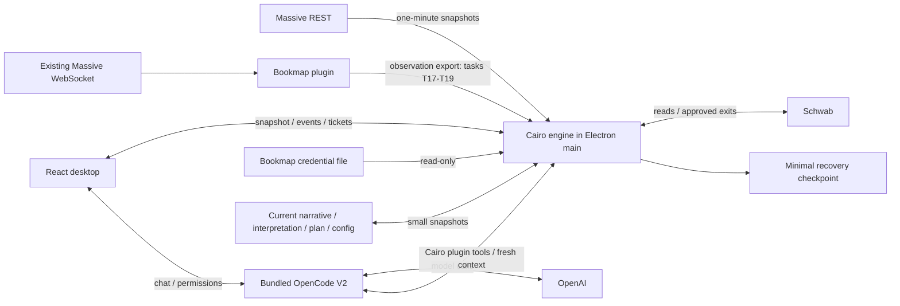

# Cairo MVP: executable coding handoff

October 4, 2026. This is the final coding plan for the agreed MVP, organized as 50 small tasks. **No coding tasks have been completed yet.** Planning through the user's latest chart correction was committed locally in Cairo as `8f7a2d76b55afd89ff008932471b567857836880` before this handoff was written.

Start here when implementing. This document supersedes earlier milestone ordering and provisional recommendations in this folder. Human instructions and applicable AGENTS.md always take precedence. [PLAN-DECISIONS.md](PLAN-DECISIONS.md) preserves what the user explicitly chose; the defaults below resolve routine implementation choices for this handoff without pretending the user separately selected them. [MANAGEMENT-GUIDELINES.md](MANAGEMENT-GUIDELINES.md) explains the human-language workflow. Documents in `docs/opencode/` are reference material, not additional requirements.

## 1. The product to deliver

A personal Windows desktop for US stocks, built with TypeScript, Electron, React, and Vite. A trader and Cairo coauthor setup-specific tradebooks in human language. Cairo observes live Bookmap patterns and current Schwab positions/orders, explains entry opportunities, and monitors open trades against their attached management guidelines.

**Entries are observer-only.** Cairo detects and recommends; the trader executes in Schwab, ViteApp, or their existing interface. Cairo picks up that position from the broker.

**Exits are observer through assistant.** Cairo recommends or stages exact partial/full closes and supported protective exit-order changes. Every actual submit/cancel/replace requires human approval of that request, followed by current-state validation. Accepting a guideline is not approval of orders. A stop change after an approved partial exit fills needs a new approval.

**Charting is deliberately secondary.** Load Massive REST aggregated one-minute bars on selection/manual Refresh. Show snapshot age. Cairo opens no Massive WebSocket: Bookmap already uses the user's available connection. Do not reconstruct a substitute stream by polling individual REST trades. Sharing raw data from Bookmap and live candle building are deferred. Stale bars supply context, never fresh entry/exit triggers. Live ORB is deferred; the one-minute ORB remains a narrative example and synthetic rule fixture.

**The AI runtime is Embedded OpenCode V2 with a Cairo plugin.** OpenCode owns model calls, streaming, sessions, tool continuation, compaction, and generic permissions. The Cairo engine owns normalized facts, rule monitoring, arithmetic, tickets, approvals, and broker requests. There is one live copilot, using one user-configured OpenAI model. Do not implement a second custom OpenAI loop or Agents SDK runner.

**Schwab authorization belongs to Bookmap.** Read the valid token produced/maintained by `bookmap-plugin` from its configured credential file, default `%USERPROFILE%\bmtrader\secrets.json`, and call Schwab directly from Cairo's backend. Cairo never refreshes the token or writes that file. Bookmap is an existing running companion, not a process Cairo starts or stops.

**No Cairo database.** Current live state, drafts, approvals, and bounded session activity remain in memory. Retain only current authored artifacts/configuration and a small recovery checkpoint for uncertain broker actions and essential attached-position state. OpenCode may retain its own internal session storage. Do not add SQLite, ORM, migrations, event sourcing, a general JSON database, recording/replay, journaling, or research/backtesting infrastructure.

## 2. Implementation defaults

These are practical defaults selected for this final handoff. Change a default only for a demonstrated compatibility issue or later user instruction; record the reason and affected tasks. Do not silently expand confirmed scope.

| Topic | Default |
| --- | --- |
| Engine process | An independent asynchronous TypeScript module inside Electron main. Renderer reload does not restart it. No utility-process framework initially. |
| OpenCode hosting | Pinned bundled local headless server sidecar, with a Cairo-owned location/config and client adapter. T01 proves the actual Windows/server/plugin combination before depending on it. |
| Bookmap transport | Observation-only messages on the existing local WebSocket server, normally `ws://127.0.0.1:8765`. No JSONL writer, file tail, or historical replay fallback. |
| Observation bootstrap | Plugin sends current source status and a bounded episode snapshot on connection, then live updates/status. Cairo treats snapshot episodes as context, not new signals. No inbound trading/config commands are needed from Cairo. |
| Observation configuration | Add only the local Bookmap observation enable/symbol/detector settings needed for Cairo. Keep these separate from native order-execution eligibility. A missing detector/config remains visible. |
| Tradebook authoring | Human-language Markdown edited directly or through chat. Cairo maintains a small reviewed JSON interpretation next to the narrative; users never need to author JSON/YAML/rules. |
| Artifact activation | Explicit review/accept and per-position attachment. Editing files/chat drafts proposes a change; it does not hot-swap a live attachment. |
| Initial example | Gap Give and Go / bid-reappear narrative from the user's Backtest folder, with honest unsupported clauses and no inserted management defaults. ORB is only a separate example/fixture. |
| UI scope | One focus chart/selected setup and one chat. A positions list monitors all selected-account holdings and their attachments independently of chart focus. No multi-chart/watchlist scanner. |
| Initial order scope | Whole-share equity partial/full closes and tested regular-session DAY market/limit/stop protective shapes. Unsupported fractional, derivative, order-type, session, or topology changes remain manual and visible. |
| Broker updates | Modest configurable REST polling/coalesced refresh, plus refresh after a known action. No new Schwab streaming/quote connection is required. |
| Local API | One small loopback HTTP API plus an in-memory event stream for UI/plugin. Preload supplies lifecycle/config access; do not duplicate domain mutations over IPC and HTTP. |
| Project/dependencies | One Cairo project with clear modules, npm scripts and a lockfile. Keep state/UI libraries small. Use the official Lightweight Charts package at a verified compatible version. |

If the promised OpenCode V2 Windows artifact/plugin API cannot be obtained, T01 records the actual blocker and compatible options. Do not implement a custom harness or quietly substitute V1. Non-AI work can continue, but the selected-runtime tasks and final completion stay blocked until resolved.

## 3. Architecture and source boundaries



Suggested organization, not a requirement to create empty scaffolding for everything:

```text
src/main/                 Electron startup and owned processes
src/preload/              Narrow desktop bridge
src/renderer/             React chart, positions, tradebook, chat, tickets
src/shared/               Domain/API contracts and schema validation
src/engine/               state, files, market, bookmap, broker, rules, execution, api
src/copilot/              OpenCode client/lifecycle and Cairo plugin
tests/fixtures/           Synthetic provider/broker/observation examples
docs/chatgpt/             This checklist, task notes, compatibility and user guide
```

The final task layout may differ, but the engine imports no DOM/chart/React globals. Do not import entire ViteApp runtime modules or their Firebase/strategy behavior. Vendor-copy only the relevant pure functions with source/license attribution. ViteApp and Backtest are read-only reference repositories.

Only T17–T19 require additive source changes in the sibling `bookmap-plugin` repository. Read its own instructions first and preserve unrelated edits. Other tasks belong in Cairo. Do not move the Java detector into Cairo, relay full depth/trades/quotes, alter existing native trading behavior, or turn the observation channel into an order channel.

### Local reuse map

Links resolve relative to this document in `cairo/docs/chatgpt/`.

| Source | Reuse / caution |
| --- | --- |
| [Massive REST API](../../../ViteApp/src/trading/libraries/massive/api.ts), [mapper](../../../ViteApp/src/trading/libraries/massive/mapper.ts) | `getPriceHistory(symbol, 1, date)`, pagination, and `mapAggregate`; leave streaming and REST trade backfill unused. |
| [Session clock](../../../ViteApp/src/trading/core/marketdata/marketClock.ts) | Eastern/DST conversion and session labels; a timestamp does not prove live source mode. |
| [Schwab reader](../../../ViteApp/src/trading/libraries/broker/schwab/readApi.ts) | Read codecs/HTTP patterns. Fix its first-account assumption; use the explicitly selected account and complete working-order coverage. |
| [Account projection](../../../ViteApp/src/trading/libraries/broker/schwab/accountProjection.ts) | Positions, recursive order trees, recent fills. Preserve statuses and standalone protection; no full trade ledger. |
| [Closing order factory](../../../ViteApp/src/trading/libraries/broker/schwab/closingOrderFactory.ts) | Pure equity closing payloads; infer SELL versus BUY_TO_COVER from the actual position. Do not copy the entry factory. |
| [Bookmap credentials](../../../bookmap-plugin/src/main/java/com/bookmap/plugin/rong/miniviteapp/runtime/LocalCredentials.java) | Persisted file handoff/rotation ownership. Inspect source, not real secret contents during development. |
| [Bookmap pattern serialization](../../../bookmap-plugin/src/main/java/com/bookmap/plugin/rong/patterns/BookmapPatternSignal.java), [store](../../../bookmap-plugin/src/main/java/com/bookmap/plugin/rong/patterns/PatternSignalStore.java) | Episodes update in memory and can receive new UUIDs; deduplicate by source/symbol/episode, not UUID alone. |
| [Plugin](../../../bookmap-plugin/src/main/java/com/bookmap/plugin/rong/RongPlugin.java), [WebSocket server](../../../bookmap-plugin/src/main/java/com/bookmap/plugin/rong/SignalWebSocketServer.java) | Pattern serialization exists but export still needs implementing. Current external `onMessage` ignores inputs; use server-pushed status/snapshot, not invented request endpoints. |
| [Gap Give and Go](../../../Backtest/tradebooks/gap_give_and_go.md), [bid reappear](../../../Backtest/tradebooks/bookmap_patterns/bid_reappear.md), [pattern guidance](../../../Backtest/tradebooks/bookmap_patterns/bookmap_patterns.md) | Preserve trader wording/context. A detector badge need not cover every narrative clause. |

### Runtime evidence to verify in T01

The current [OpenCode plugin documentation](https://opencode.ai/v2/docs/build/plugins) describes `@opencode/plugin`, registration, hooks, and tools. The [network client documentation](https://opencode.ai/v2/docs/build/client) describes `@opencode/client`, resource APIs, and live-only subscriptions without replay/automatic reconnection. This motivates explicit resubscription and fresh snapshots, not a second event database.

The [permission documentation](https://opencode.ai/v2/docs/permissions) distinguishes one-time from saved approval. Cairo accepts only one-time exact-ticket approval for trading; a generic or saved OpenCode allowance never bypasses engine validation. The [SDK documentation](https://opencode.ai/v2/docs/build/sdk) describes a separate in-process hosting option; it is not the selected sidecar default. These pages were rechecked on October 4, 2026; the package/binary versions remain unproven until T01.

## 4. Working protocol for the coding agent

1. Read this document, the latest human messages, and applicable AGENTS.md. Inspect status in every repository you will touch. Preserve unrelated changes; do not reset or stage them.
2. Start with the first unchecked task whose dependencies are done. Work in order by default. If an external blocker occurs, record it under that task and continue only with independent tasks. Never check off a mock implementation as a real integration.
3. Implement just the task's deliverable. Use synthetic/fake feeds, credentials, broker responses, and model responses for automated checks. No paid inference or real order is needed to complete tests. Live order testing requires a separate explicit user instruction.
4. Run the stated verification and relevant type/build checks. For visual-only changes, inspect the UI; do not add tests that merely mirror markup. Add meaningful state-transition tests where listed.
5. Replace that task's `[ ]` with `[x]` only when deliverable and verification pass. Immediately below the task, record actual commands/results and any supported limitations. If blocked, leave it unchecked and record what is missing.
6. Commit the task separately, with its ID in the subject, using its suggested commit message or a more accurate one. Include its checklist/verification update in that commit. Never combine several tasks into one feature commit or leave passed work uncommitted while proceeding.
7. For T17–T19, commit the code/test change in `bookmap-plugin`, then make a separate Cairo progress commit recording that sibling hash and checking off the task. This is one logical task with one local commit per touched repository; never bundle sibling changes with unrelated Cairo implementation.
8. Inspect the diff/status after committing, then proceed to the next task without asking for routine confirmation. Do not amend earlier completed task commits to hide subsequent changes. A discovered defect gets a focused repair commit naming the affected task and invalidates any dependent completion until verified again.
9. **Never push any commit or branch to a remote.** Leave commits local for user review/manual pushing. Do not auto-deploy, send messages, or create a release remotely.

Use the task-ID commit subject as the commit reference; a commit cannot contain its own final hash. Retrieve hashes with `git log --oneline --grep=Txx` when reporting. A sibling hash can be recorded in the following Cairo progress commit. Keep notes here concise; put lengthy diagnostics in an additional document under this folder and link it.

At session end report completed IDs, local hashes/repositories, checks, and the next actionable task. The next agent rereads the checked boxes, notes, and Git history and resumes from that state. This checklist is the durable progress record; do not rely on chat memory.

## 5. Contracts that every task must preserve

### Sources and policy

- REST chart bars, derived ranges/VWAP, and close prices are tagged with fetch/latest-bar time and treated as snapshot context. A snapshot load/refresh cannot create a fresh signal or prove a live exit condition.
- Bookmap observations carry source-instance identity, sequence, symbol/alias mapping, real-dollar price units, episode/revision, event/receive time, detector/config revision, live/replay/unknown mode, and readiness/heartbeat/reset. Preserve nanoseconds as strings. Never guess price scaling or live mode.
- The existing installed Bookmap API must supply trustworthy mode/readiness evidence. If mode cannot be proven, show observer-only source status and block source-dependent assistant proposals; supported explicit trader-requested exits remain possible using current broker facts.
- Pattern prices are event evidence, not continuous bid/ask/trade prices. A guideline requiring unavailable fresh data remains advisory/needs confirmation. Chart staleness alone does not block Bookmap-only monitoring or manual exit tickets.
- The original management narrative is preserved. Internal rules trace to clauses and declare condition/source/timing, bound values, action/quantity basis, once/recurrence/dependencies, and coverage. No invented target, breakeven, R multiple, tier, or wall threshold is installed as trader policy.
- An accepted interpretation binds to one setup/trade/position. File edits, model drafts, chart focus changes, and setup selection cannot silently replace another position's active snapshot. Logical allocations exist only when requested.

### Broker requests

- Read-only token provider checks a nonempty access token and finite expiry with a 60-second lead, rereads before a write, adopts producer rotations, and handles rejection even if expiry looks valid. Credentials never enter renderer/model/fixtures/logs/recovery.
- Broker positions, working orders, and confirmed fills are authoritative. An accepted order or touched target is not a fill. Poll coverage must include existing protection, including prior-day working orders; do not query only today's orders and claim complete coverage.
- Engine validation rejects opening/increasing/reversing a position, including calls that have generic tool permission or a ticket approval. Use position side/available quantity/order relationships, not BUY/SELL alone.
- Serialize per account/symbol; reserve pending/unknown close quantities; deduplicate local commands and approvals. One-time approval binds exact fields, ticket ID, expiry, and relevant plan/position/order revisions. Invalidate materially changed facts; unrelated polling must not invalidate a still-identical ticket merely by incrementing a global sequence.
- Supported protection transitions must account for whole stop/OCO relationships. No close can leave known excess working protection unnoticed. Never submit a destructive cancel/replace automatically as a side effect of an approved close. Show each next exact request and wait for its approval; uncertain/cancel-not-confirmed states block conflicting steps. Unsupported topology stays manual.
- Before a real request, successfully checkpoint its exact minimal attempted action. Timeout-after-send is unknown, not failure permission to retry. Reconcile known IDs/recent broker facts; ambiguous matching needs resolution.
- Restart discards drafts/approvals, refetches broker facts, reconciles attempts without resending, confirms attachments, and reactivates monitoring. It restores no execution permission.

### Files and retention

Use Electron's user-data directory for current `config.json`, `tradebooks/<id>.md`, `tradebooks/<id>.rules.json`, `active-plan.json`, and `recovery.json`. Names are implementation defaults. The interpretation stores the narrative revision/hash; a mismatched pair cannot activate. Active attachments retain their reviewed snapshot even if the current source file changes. Use small serialized temp-file replacement for authored/recovery snapshots, not an append-only framework.

API keys are configured locally outside the repository using the runtime's supported provider mechanism or a backend-only environment/local credential source. Prefer OpenCode's own supported key integration. Do not add a cloud account service or credential vault project. The Bookmap credential file remains read-only.

Prune resolved attempted actions and closed attachments. Save only rule state/allocations needed to avoid a duplicate action or wrong attachment; do not build complete trade/fill accounting. All other live projections, proposals, unused approvals, and session activity are bounded memory. OpenCode's own history cannot restore a trading approval.

## 6. Task checklist

Each checkbox is the completion flag. Each task needs its own local commit and actual verification note. Dependencies use task IDs; all dependencies precede their consumer.

### Foundation — T01–T08

- [ ] **T01 — Prove and pin the OpenCode V2 Windows runtime**

**Depends:** none. **Repository:** Cairo.

**Deliver:** A reproducible small probe and compatibility note with actual server binary/package/client/plugin versions, launch/plugin-loading mechanism, licenses/notices, and a fake Cairo read tool plus mock one-time permission interaction. Determine how to package runtime/plugin dependencies without globally installed Bun/Node. Use a fake provider or direct mock contract path; label what was actually exercised.

**Verify:** Launch/stop the chosen Windows runtime, load the plugin, call a fake read, and demonstrate the chosen permission path. Record any unavailable artifact instead of asserting compatibility. **Commit:** `build(T01): prove pinned OpenCode V2 Windows integration`.

- [ ] **T02 — Bootstrap the TypeScript Electron/React project**

**Depends:** T01 for pinned runtime choices; scaffold can proceed if T01 has an external blocker. **Repository:** Cairo.

**Deliver:** Minimal main/preload/React renderer with Vite, strict TypeScript, lockfile, `dev`, `typecheck`, `test`, `build`, and later packaging-script placeholders only where needed. Add ignore rules for dependencies/builds/local secrets. Start with a small synthetic test runner and fake mode, not real provider connections.

**Verify:** Clean dependency install, typecheck, build, and Windows dev-window smoke. **Commit:** `build(T02): bootstrap Electron React TypeScript shell`.

- [ ] **T03 — Define small domain contracts and fake I/O ports**

**Depends:** T02. **Repository:** Cairo.

**Deliver:** Contracts for timestamped chart context, Bookmap observations, broker facts, tradebooks/interpretations, position attachments, exit tickets, and source status. Provide fake clock, HTTP/broker responses, and observation sources through simple interfaces; no dependency-injection framework.

**Verify:** Representative valid/invalid inputs exercise boundary parsing, unknown mode, nonfinite prices, and absent fields. Fakes make no network calls. **Commit:** `feat(T03): define Cairo contracts and fake ports`.

- [ ] **T04 — Own the engine lifecycle in Electron main**

**Depends:** T03. **Repository:** Cairo.

**Deliver:** Independent engine module with start/stop, bounded memory state, async scheduling, and observer-first initialization. Electron main owns it; renderer remount/reload does not recreate it. Ensure owned timers/listeners stop cleanly.

**Verify:** Renderer reload preserves engine instance/state; app exit clears resources; startup has no action authority. **Commit:** `feat(T04): host asynchronous engine in Electron main`.

- [ ] **T05 — Implement engine snapshot and event endpoints**

**Depends:** T04. **Repository:** Cairo.

**Deliver:** One loopback health/snapshot API and event stream with runtime-instance/in-memory sequence. Bridge snapshot/subscription races with a bounded buffer; after disconnect/gap fetch current state. Expose small read/command endpoints only as consumers require them.

**Verify:** A synthetic update during initial snapshot is neither lost nor duplicated; reconnect/runtime change refreshes state. No durable event log. **Commit:** `feat(T05): expose snapshots and in-memory engine events`.

- [ ] **T06 — Add the desktop workspace and source-status view**

**Depends:** T05. **Repository:** Cairo.

**Deliver:** React layout with one chart area, selected setup/plan, positions, copilot, and ticket area. Connect snapshot/events and render independent chart/Bookmap/broker/AI statuses, including unknown/disconnected states. Keep layout usable with fake data.

**Verify:** Inspect the window and simulate reconnect; source status is explicit and renderer subscriptions dispose on unmount. **Commit:** `feat(T06): add trading workspace and source status`.

- [ ] **T07 — Load local configuration and backend key sources**

**Depends:** T04, T06. **Repository:** Cairo.

**Deliver:** Current config for selected account, Bookmap endpoint, token-file path, chart symbol/date, polling interval, and one provider/model selection. Load Massive/OpenAI keys via backend-only local/runtime mechanisms; fake mode needs none. Support app data paths containing spaces.

**Verify:** Missing settings produce setup prompts/status; no key appears in UI state, API snapshots, logs, Git, or model context. **Commit:** `feat(T07): configure local sources and provider settings`.

- [ ] **T08 — Save current narratives, interpretations, and plans**

**Depends:** T03, T07. **Repository:** Cairo.

**Deliver:** Small file loader/writer for Markdown tradebooks, clause-linked JSON interpretations, and active plan. Store revision/narrative hash, validate a pair before activation, serialize replacements, and keep unaccepted drafts in memory. No version-history repository.

**Verify:** Missing/corrupt/mismatched files cannot activate; saving and reopening a current artifact works; an existing active snapshot is not silently overwritten. **Commit:** `feat(T08): persist current authored trading artifacts`.

### Broker visibility and snapshot chart — T09–T15

- [ ] **T09 — Adapt the Massive one-minute REST reader**

**Depends:** T03, T07. **Repository:** Cairo.

**Deliver:** Backend REST aggregate fetch/mapping/pagination from the reuse map. Cache by symbol/minute and replace/upsert snapshots. Preserve fetch/bar times and empty/error results; no streaming module, trade endpoint polling, or forming-minute reconstruction.

**Verify:** Pagination, empty results, overlap replacement without volume accumulation, and failed refresh retaining the old snapshot. Instrument the fake network boundary to confirm no WebSocket/trade polling. **Commit:** `feat(T09): load Massive one-minute REST snapshots`.

- [ ] **T10 — Render the basic one-minute snapshot chart**

**Depends:** T06, T09. **Repository:** Cairo.

**Deliver:** Official Lightweight Charts candles/volume, symbol/date selection, manual Refresh, and snapshot/no-live-updates label with fetch/latest-bar time. Essential plan/order overlays can be added as their data arrives. Create/dispose the chart once per view; no five-minute view or chart polish prerequisite.

**Verify:** Inspect fresh/aged/error/empty states; stale data is visible, refresh does not sum volume, switching symbols cancels stale results. **Commit:** `feat(T10): display timestamped one-minute chart context`.

- [ ] **T11 — Consume the Bookmap Schwab token read-only**

**Depends:** T03, T07. **Repository:** Cairo.

**Deliver:** Token provider for the configured producer file: `schwab.access_token`, `schwab.expires_at` in epoch milliseconds, and explicit selected-account binding. Use the 60-second expiry lead, reread/adopt rotations, and never refresh/write the file. Default to waiting status on missing/stale data.

**Verify:** Fake files cover BOM, malformed JSON, expiry, rotation, file replacement, and rejection invalidation without any real secrets. **Commit:** `feat(T11): read Bookmap-maintained Schwab authorization`.

- [ ] **T12 — Read the explicitly selected Schwab account**

**Depends:** T11. **Repository:** Cairo.

**Deliver:** Direct backend HTTP account/account-number mapping reads and explicit account selection. Normalize equity positions including long/short/fractional/external holdings. Preserve raw identity/status needed for later validation. Do not default to the first returned account.

**Verify:** Multiple accounts and external/carry-in positions select correctly; auth failure marks stale without retrying a write. **Commit:** `feat(T12): project selected Schwab account positions`.

- [ ] **T13 — Project complete working orders and relevant recent fills**

**Depends:** T12. **Repository:** Cairo.

**Deliver:** Standalone and recursive stop/target/OCO order relationships, working/partial/filled/canceled/replaced/rejected/unknown statuses, and deduplicated recent fills. Query enough broker state to include prior-day working protection; report incomplete coverage honestly. No full past-fill/tax-lot ledger.

**Verify:** Fixtures for standalone stops, OCO siblings, prior-day working orders, partial/canceled-after-fill orders, and repeated fill observations. **Commit:** `feat(T13): normalize protection orders and recent fills`.

- [ ] **T14 — Refresh broker facts with coalesced REST polling**

**Depends:** T12, T13. **Repository:** Cairo.

**Deliver:** Modest configurable account/order polling, manual refresh, and coalescing overlapping refresh requests. Publish actual fact revisions separately from refresh sequence. Broker-returned marks retain known source/time; unknown freshness is not treated as live data. No new quote/stream integration.

**Verify:** One request runs at a time, unchanged facts keep ticket-relevant revisions stable, disconnected/auth-failed data is visibly stale, and shutdown stops polling. **Commit:** `feat(T14): refresh broker facts without duplicate reads`.

- [ ] **T15 — Display positions, protection, and account availability**

**Depends:** T06, T14. **Repository:** Cairo.

**Deliver:** All selected-account positions and known working protection/recent fills, supported versus manual actions, and broker availability. Held positions remain visible while chart focus changes; chart close is never shown as an unqualified live mark. Add essential order overlays where useful.

**Verify:** Inspect long/short/fractional, carry-in, OCO, stale token, and stale-chart combinations. **Commit:** `feat(T15): show current positions and broker protection`.

### Bookmap observation bridge — T16–T20

- [ ] **T16 — Specify the observation envelope from installed APIs**

**Depends:** T03. **Repository:** Cairo; read Bookmap source only.

**Deliver:** A concise bridge contract/fixtures covering episodes, real-dollar prices, source instance/sequence, symbol mapping, detector/config revision, mode/readiness, heartbeat/reset, and snapshot versus live update. Inspect installed API metadata and existing local detector eligibility. Document exact missing fields and how unknown mode is handled.

**Verify:** Contract examples parse; no timestamp-based live-mode guess, raw depth relay, token broadcast, or inbound trading command is part of the design. **Commit:** `docs(T16): define verified Bookmap observation contract`.

- [ ] **T17 — Broadcast pattern observations without executing trades**

**Depends:** T16. **Repository:** bookmap-plugin, followed by Cairo progress commit.

**Deliver:** Additive export at the existing pattern-update/store path to the existing WebSocket server. Preserve badges/sounds/detector behavior and episode identity/revision. Use existing price normalization; leave the Massive connection untouched. No JSONL persistence.

**Verify:** Relevant Java tests show exported create/update observations and no routing into native execution. **Commit:** `feat(T17): export Bookmap pattern observations`; Cairo note records the sibling hash.

- [ ] **T18 — Enable observation detection independently of native execution**

**Depends:** T17. **Repository:** bookmap-plugin, followed by Cairo progress commit.

**Deliver:** Minimal local observation-enable/symbol/detector configuration. Existing detector eligibility currently depends on enabled native tradebook groups; provide a separate read-only observation eligibility path without activating native entries/exits or overwriting existing execution configuration.

**Verify:** A locally enabled observer receives patterns with native execution disabled; legacy native behavior remains unchanged. **Commit:** `feat(T18): separate observation eligibility from native execution`; record sibling hash.

- [ ] **T19 — Send source status, heartbeat, reset, and connection snapshot**

**Depends:** T17, T18. **Repository:** bookmap-plugin, followed by Cairo progress commit.

**Deliver:** Server-pushed metadata/status and bounded current episode snapshot on client connection, plus heartbeat/reset/config changes. Prove readiness/mode using installed metadata or label unknown. Distinguish historical/replay/live and per-symbol readiness. Keep snapshot/status transfer off detector hot-path blocking work.

**Verify:** Reconnect supplies current context; resets/new source instances are distinguishable; unknown/replay is never labeled live; existing clients tolerate additive message types. **Commit:** `feat(T19): publish Bookmap source status and snapshots`; record sibling hash.

- [ ] **T20 — Consume and normalize the live observation stream in Cairo**

**Depends:** T05, T16, T19. **Repository:** Cairo.

**Deliver:** WebSocket receiver, bounded episode projection, heartbeat age/readiness, source reset/reconnect handling, and alias/price normalization. Deduplicate by source/symbol/episode; bootstrap snapshots restore context without fresh alerts. No file-tail fallback or raw market-data feed.

**Verify:** Fake server exercises duplicate UUID-changing updates, snapshot/live overlap, missing heartbeat, replay/unknown, malformed units, and reset. **Commit:** `feat(T20): ingest Bookmap observations with source status`.

### Tradebooks and useful observer — T21–T28

- [ ] **T21 — Evaluate small predicates with honest source coverage**

**Depends:** T03, T09, T20. **Repository:** Cairo.

**Deliver:** Pure scalar/group/registered-Bookmap-event/scoped-human-confirmation evaluation with satisfied/pending/invalid/unknown evidence. Explicitly distinguish historical snapshot context from required fresh inputs; unsupported clauses remain visible. No arbitrary generated code or universal compiler.

**Verify:** Missing/replay/unready inputs never become true, stale candle refresh cannot fire a live rule, and fresh Bookmap-only rules work with a stale chart. **Commit:** `feat(T21): evaluate supported rules with source coverage`.

- [ ] **T22 — Define the internal guideline interpretation and validator**

**Depends:** T08, T21. **Repository:** Cairo.

**Deliver:** Clause-linked conditions/actions/quantity bases, level binding, once/recurrence/dependencies, optional allocations, and coverage. Validate only needed fields, preserving original wording. Detect conflicting/unsupported mandatory clauses and material ambiguity before activation.

**Verify:** Two distinct example styles validate differently; ambiguous “some”, undefined “weakness”, invalid quantities, and missing fresh data cannot be silently filled with defaults. **Commit:** `feat(T22): validate clause-linked management interpretations`.

- [ ] **T23 — Edit narrative tradebooks and concrete active plans**

**Depends:** T06, T08, T22. **Repository:** Cairo.

**Deliver:** Human-language editor, setup selection, simple concrete level/date/symbol inputs, and original-clause/interpretation/coverage view. Save accepted current files; unaccepted edits are proposals. No trader-facing rule-language authoring requirement.

**Verify:** Inspect save/reopen, unresolved coverage, revision mismatch, and editing a setup while another active attachment remains unchanged. **Commit:** `feat(T23): author narrative tradebooks and active plans`.

- [ ] **T24 — Import the personal reference and separate ORB example**

**Depends:** T22, T23. **Repository:** Cairo.

**Deliver:** Read-only import of selected Backtest narrative into a draft/current user artifact, with attribution. Preserve bid-reappear context, key levels, either-side-of-VWAP allowance, and the trader's actual management wording. Mark unsupported clauses; do not choose allocation percentages or targets for the trader. Add ORB only as a narrative/synthetic fixture.

**Verify:** Readback retains the cited personal semantics; no mandatory generic VWAP/breakeven/tier policy appears; live ORB remains unavailable. **Commit:** `feat(T24): seed personal narrative and ORB reference`.

- [ ] **T25 — Detect one observer entry signal per active attempt**

**Depends:** T20, T21, T24. **Repository:** Cairo.

**Deliver:** Activate/deactivate reviewed observation attempts, frozen input snapshot, expiry/rearm for alerts, and episode evidence. Updates amend one signal; reconnect/bootstrap/history never fires a new entry. Entry actions end at recommendations, not tickets for broker submission.

**Verify:** Duplicate/updated episodes, reset, missing hard gates, and inactive attempts; instrument fake broker to assert zero writes. **Commit:** `feat(T25): observe entries without order submission`.

- [ ] **T26 — Attach setup-specific guidance to broker positions**

**Depends:** T14, T22, T23. **Repository:** Cairo.

**Deliver:** Explicit reviewed attachment to account/symbol/position using a frozen setup/plan/interpretation snapshot. Confirm carry-in context and requested allocation quantities/remainder; outside fills invalidate uncertain mapping. Selection/chart changes affect no other attachment.

**Verify:** Two positions keep different styles; source edits do not hot-swap them; external adds/exits expose uncertainty; fractional holdings remain visible/manual. **Commit:** `feat(T26): bind reviewed guidance to current positions`.

- [ ] **T27 — Monitor management conditions and propose exits**

**Depends:** T21, T26. **Repository:** Cairo.

**Deliver:** In-memory rule state and once/dependency handling for attached guidance. Emit recommendations/proposal inputs from current evidence; fill-dependent follow-ups wait for actual fills. Qualitative/unavailable-data clauses remain advisory/confirmation-needed. No direct broker write path.

**Verify:** Different styles, stale chart with live Bookmap evidence, duplicate events, partial/outside fills, and fill-before-follow-up; no automatic writes. **Commit:** `feat(T27): monitor attached management guidelines`.

- [ ] **T28 — Display observer evidence and bounded notifications**

**Depends:** T25, T27. **Repository:** Cairo.

**Deliver:** Entry evidence, missing conditions, attached management readback, recommendations, bounded session timeline, and deduplicated desktop alerts. Distinguish no pattern from no source. Focus a position without stopping other monitoring.

**Verify:** Inspect complete/pending/disconnected cases and repeated episodes; relevant observers continue with OpenCode unavailable. **Commit:** `feat(T28): explain observer signals and management alerts`.

### One OpenCode copilot — T29–T35

- [ ] **T29 — Integrate the owned OpenCode sidecar lifecycle**

**Depends:** T01, T04, T07. **Repository:** Cairo.

**Deliver:** Use the verified pinned launch/client arrangement with a Cairo-owned registration/location/config. Handle start failure, health, process exit, explicit restart, and shutdown. Do not stop/reconfigure another user's OpenCode process. Keep token/data directory outside repository.

**Verify:** Fake/unavailable/crashed sidecar does not stop engine/account/Bookmap monitoring; owned processes close cleanly; restart uses fresh state. **Commit:** `feat(T29): manage Cairo OpenCode sidecar lifecycle`.

- [ ] **T30 — Register the Cairo domain plugin and read/proposal tools**

**Depends:** T29, T05, T22. **Repository:** Cairo.

**Deliver:** Thin plugin tools for bounded context/artifact/position reads, guideline proposals, and exit proposal staging adapters. Until tickets exist, staging reports unavailable rather than pretending success. Expose only needed domain capabilities; no shell/filesystem coding tools or broker credentials in the trading session.

**Verify:** Fake tool inputs are validated; bounded outputs label source times/coverage; entry/open/increase intent is rejected. **Commit:** `feat(T30): register Cairo copilot domain tools`.

- [ ] **T31 — Inject fresh context before model steps**

**Depends:** T30, T20, T26. **Repository:** Cairo.

**Deliver:** Verified OpenCode context hook/adapter that supplies current account/attachments, source status, bounded evidence, and timestamped chart context on initial requests and continuations. Filter unrelated sessions/locations. Set cancellation/stale-result and context-size limits.

**Verify:** A tool continuation after an outside fill sees the new broker facts; stale chat summaries/chart bars do not become current authority. **Commit:** `feat(T31): refresh bounded trading context for copilot runs`.

- [ ] **T32 — Add streaming chat, cancellation, and reconnect**

**Depends:** T06, T29, T31. **Repository:** Cairo.

**Deliver:** One live chat using the pinned client, one configurable model/provider connection, streaming/tool status, cancellation, error display, and explicit resubscription/snapshot refresh after connection loss. Reuse OpenCode sessions; no Cairo chat database.

**Verify:** Fake responses exercise streaming/cancel/disconnect and session recovery without duplicate subscriptions. Optional real-provider smoke is separate from automated checks. **Commit:** `feat(T32): add streaming OpenCode trading copilot`.

- [ ] **T33 — Interpret human-language guidelines through the copilot**

**Depends:** T22, T23, T32. **Repository:** Cairo.

**Deliver:** Narrative-to-interpretation proposal with clause traceability, targeted ambiguity clarification, and plain-language readback. Validate model output through the engine. Retain prose and unresolved portions rather than auto-installing generated policy.

**Verify:** Fake outputs for two setup styles, invented thresholds, unsupported observations, missing quantities, malformed/partial streaming results, and stale narrative revisions. **Commit:** `feat(T33): coauthor reviewed management interpretations`.

- [ ] **T34 — Accept artifact proposals and review position-policy changes**

**Depends:** T08, T26, T33. **Repository:** Cairo.

**Deliver:** Explicit accept/reject for artifact revisions and position-specific proposed policy updates. Show changed clauses/impact; bind acceptance to current narrative/position revision. Preserve completed-action semantics when replacing a policy, rather than resetting a once-only exit by renaming its rule.

**Verify:** Stale proposal rejected, file edit doesn't replace live guidance, and accepted changes don't duplicate a previously completed action. **Commit:** `feat(T34): review and apply current policy proposals`.

- [ ] **T35 — Wake the copilot on a few meaningful events**

**Depends:** T27, T31, T32. **Repository:** Cairo.

**Deliver:** Coalesced session input for newly eligible episodes, meaningful position changes, and management recommendations using the verified API. Bound frequency, deduplicate repeated evidence, and avoid per-tick/heartbeat inference. Machine-originated inputs grant no action permission.

**Verify:** Duplicate episode updates produce one bounded wake-up; cancellation/AI failure preserves deterministic monitoring and pending human review. **Commit:** `feat(T35): coalesce meaningful copilot event updates`.

### Approved assistant exits — T36–T46

- [ ] **T36 — Build only supported equity exit payloads**

**Depends:** T13, T22. **Repository:** Cairo.

**Deliver:** Pure partial/full close and supported protective market/limit/stop factories for current whole-share equity holdings. Derive SELL/BUY_TO_COVER from current side, validate finite prices/precision/session/duration, and declare unsupported shapes. No entry-order factory.

**Verify:** Long/short close fixtures, price rounding, invalid/fractional/excess quantity, and unsupported shapes. **Commit:** `feat(T36): build supported equity exit payloads`.

- [ ] **T37 — Validate exit eligibility against current broker facts**

**Depends:** T14, T26, T36. **Repository:** Cairo.

**Deliver:** Authoritative validator for actual position side/available quantity, stale/incomplete account state, supported order relationships, required evidence, and proposal versus explicit trader-request context. Reject open/increase/reverse intents even if approved or allowed by OpenCode. Stale chart alone does not reject a valid explicit close.

**Verify:** Wrong account/symbol, zero/excess/opposite-side actions, unavailable condition evidence, external fills, and generic tool permission bypass attempts. **Commit:** `feat(T37): enforce exit-only broker action eligibility`.

- [ ] **T38 — Stage exact exit tickets in memory**

**Depends:** T27, T30, T37. **Repository:** Cairo.

**Deliver:** Engine-built ticket ID, exact payload/affected orders, reason/source clause, expiry, meaningful fact revisions, and staged/dismissed/invalidated state. Support rule-derived proposals and explicit trader-requested supported exits; entry signals cannot stage opening tickets.

**Verify:** Duplicate staging/episode updates reuse or replace a proposal without broker writes; materially changed facts invalidate and unchanged polling does not. **Commit:** `feat(T38): stage exact exit and protection tickets`.

- [ ] **T39 — Review and approve one exact exit ticket in the UI**

**Depends:** T06, T38. **Repository:** Cairo.

**Deliver:** Approval card showing account/symbol, side/quantity/type/prices/session, working protection/impact, reason, freshness, and expiry. Approve once or dismiss; an in-memory engine approval binds exact current details. Before the writer exists, approval cannot submit.

**Verify:** Inspect ticket differences, double-click/repeat approval, expiry, external changes, and rejection. No “always approve trading” control. **Commit:** `feat(T39): approve exact current exit tickets once`.

- [ ] **T40 — Checkpoint minimal broker attempts before sending**

**Depends:** T08, T38. **Repository:** Cairo.

**Deliver:** Small serialized recovery file containing exact attempted request/local ID/account/symbol/time/known broker ID and essential active attachment/rule state. Prune resolved/closed items. Successfully write before a request; retain uncertainty across restart. No event history.

**Verify:** Failed write prevents send, incomplete/corrupt file blocks new writes pending resolution, and bounded pruning preserves still-unknown attempts. **Commit:** `feat(T40): checkpoint minimal exit attempts and attachments`.

- [ ] **T41 — Submit approved exits and track broker outcomes**

**Depends:** T11, T37, T39, T40. **Repository:** Cairo.

**Deliver:** Direct Schwab writer with fresh authorization/current-state revalidation, per-account/symbol queue, command/approval deduplication, and reserved pending quantities. Track accepted/working/partial/filled/rejected/unknown distinctly, refreshing broker facts after known outcomes. Never retry a timed-out write blindly.

**Verify:** Fake broker covers approval replay, concurrent closes, stale ticket/token, acceptance versus fill, rejection, and timeout-after-send. **Commit:** `feat(T41): submit approved exits with quantity reservations`.

- [ ] **T42 — Support exact protective cancel/replace requests**

**Depends:** T13, T37, T41. **Repository:** Cairo.

**Deliver:** Tested cancel/replace for supported existing exit protection, with exact affected order identities/relationships shown in the approval. Treat cancellation/replacement acknowledgement and final order state separately. External entry orders and unsupported topology remain manual. Every mutation has its own current approval.

**Verify:** Wrong order/account, already-filled/canceled, stale replacement, known OCO side effects, and unknown cancel/replace outcomes. **Commit:** `feat(T42): approve supported exit protection changes`.

- [ ] **T43 — Coordinate partial fills with existing protection**

**Depends:** T13, T27, T42. **Repository:** Cairo.

**Deliver:** Recompute remaining quantity/optional allocations after actual fills and flag excess/ambiguous working protection. For tested protection transitions, offer ordered next tickets, waiting for each approval and broker confirmation. Unsupported complex OCO changes require external resolution; do not silently flatten/cancel or assume multiple requests are atomic.

**Verify:** Partial/outside fills, known standalone/OCO arrangements, cancel-not-confirmed, changed quantity, and follow-up stop proposals. No excess close proceeds and no follow-up submits automatically. **Commit:** `feat(T43): reconcile partial exits and working protection`.

- [ ] **T44 — Reconcile unknown submissions without resend**

**Depends:** T40, T41, T42. **Repository:** Cairo.

**Deliver:** Resolve known broker IDs first, then bounded recent-order matching where IDs are missing. Keep pending quantities blocked for ambiguous results; show explicit resolution status. HTTP errors after attempted send are not evidence that nothing happened.

**Verify:** Accepted-but-timeout, absent ID, duplicate-looking external order, delayed visibility, unknown cancel/replace, and ambiguous matching all avoid blind resend. **Commit:** `feat(T44): reconcile uncertain broker actions`.

- [ ] **T45 — Restore attachments and reconcile on restart**

**Depends:** T14, T26, T40, T44. **Repository:** Cairo.

**Deliver:** Observer-first startup loads current files/recovery, fetches broker facts, resolves uncertainty, matches attachments, and asks for needed current-state confirmation before monitoring reactivation. Discard all old drafts/approvals/signals. Save no restored standing permission.

**Verify:** Restart after checkpoint-before-send, timeout, partial fill, outside position change, closed trade, and corrupted recovery; no submission/approval resumes automatically. **Commit:** `feat(T45): recover current state without restoring approvals`.

- [ ] **T46 — Bind OpenCode permissions to exact engine tickets**

**Depends:** T01, T30, T38, T39, T41. **Repository:** Cairo.

**Deliver:** Finish the verified tool/permission mapping so copilot exit requests show the same exact card and one-time approval. A permission reply alone cannot authorize an unbound/changed payload; the engine needs its matching current approval. Generic/saved allowances and machine events cannot grant action authority. No entry/auto-mode permission path.

**Verify:** Fake tool loop pauses for the exact card; reject/cancel/stale/duplicate replies and generic allow never submit an unapproved request. **Commit:** `feat(T46): bind copilot exit permissions to exact approval`.

### Integration and private Windows delivery — T47–T50

- [ ] **T47 — Run the complete fake trading workflow**

**Depends:** T28, T34, T35, T43, T45, T46. **Repository:** Cairo.

**Deliver:** A repeatable synthetic acceptance scenario: stale REST chart, eligible Bookmap episode, observer entry recommendation, externally filled broker position, reviewed setup-specific guidance, exit proposal, approval, partial fill, new approved protection change, and restart/unknown-outcome recovery. Include a second different management style.

**Verify:** No entry/automatic writes; exact approved exits only; no duplicate episode/ticket/submission; no stale-chart triggers; fills and protection remain consistent; AI/renderer outages preserve monitoring. Fix failures in focused commits. **Commit:** `test(T47): verify complete observer and exit-assistant workflow`.

- [ ] **T48 — Package the private Windows desktop and pinned runtime**

**Depends:** T29, T47. **Repository:** Cairo.

**Deliver:** Reproducible unpacked Windows build with the pinned OpenCode binary/plugin/client resources, built renderer/engine, and required third-party notices. Use actual package paths outside archive boundaries when needed. Bookmap remains separately installed; ship no keys/user artifacts. Private installer follows the unpacked build if supported.

**Verify:** Build from the lockfile; inspect resource layout/launch paths including spaces and a missing sidecar; no global Bun/Node dependency at runtime. **Commit:** `build(T48): package private Windows Cairo desktop`.

- [ ] **T49 — Smoke-test the packaged app across failures and reconnects**

**Depends:** T48. **Repository:** Cairo.

**Deliver:** Packaged-app verification notes and any necessary small harness for fake Bookmap/broker/model endpoints. Exercise minimize, renderer reload, sidecar failure, token rotation, observation reset, REST refresh failure, and restart. This verifies the package, not just the dev server.

**Verify:** Owned processes/resources stop cleanly; monitoring survives renderer/AI failure; stale chart stays labeled; no real broker order or paid inference is sent. Record unavailable installed-Bookmap/live verification explicitly. **Commit:** `test(T49): smoke-test packaged Windows lifecycle`.

- [ ] **T50 — Write the private setup guide and close the checklist honestly**

**Depends:** T49 and all preceding required tasks. **Repository:** Cairo.

**Deliver:** Under `docs/chatgpt/`, explain installation, local model/key setup, Bookmap plugin version/install/observation configuration, read-only token path/account selection, source statuses, narrative coauthoring/attachment, manual chart refresh, exit approval, and unknown-action recovery. List actual supported order shapes/conditions and all manual/deferred behavior. Record sibling plugin hashes and package build version.

**Verify:** Walk through fake-mode setup with the packaged app and review every checkbox against commits/checks. An unresolved selected-runtime/Bookmap dependency prevents full completion even if fake mode works. **Commit:** `docs(T50): document private MVP setup and supported behavior`.

## 7. Completion and continuation

The MVP is complete when all 50 required tasks pass, the packaged Windows app implements observer entries and approved assistant exits, the selected OpenCode runtime works, and the Bookmap observation dependency is implemented/compatible. Source-mode limitations and unsupported guidelines must be visible; a fake-only demonstration is not a live integration claim. Actual real-account/read-only connectivity may be verified by the user; no real order or paid inference is an automated release requirement.

Do not mark tasks complete because time/context is running out. Leave precise next steps and local commits. Additional automated management, assisted entries, live candles/raw-data relay, live ORB, journal/backtesting, CLI/macOS, cloud deployment, security/scalability infrastructure, and multi-agent role frameworks are outside this handoff.

## 8. Prompt to give the implementation agent

> Implement Cairo using `C:/Users/lingr/code/cairo/docs/chatgpt/CODING-PLAN.md` as the authoritative MVP coding checklist. Read applicable AGENTS.md and latest human instructions first. Start at the first unchecked task with satisfied dependencies, implement it, run its verification, record results and check it off, and make its separate local task-ID commit before proceeding. Continue through actionable tasks; record real blockers and do independent work without silently changing scope. T17–T19 need separate scoped commits in bookmap-plugin plus Cairo progress commits; ViteApp and Backtest stay read-only. The product has observer entries, exact-human-approved assistant exits, per-setup human-language management, OpenCode V2 plus a Cairo plugin, and a stale-tolerant Massive REST one-minute chart with no Cairo Massive WebSocket. Keep live state in memory and only essential authored/recovery files. Do not implement assisted entries, automated management, raw-data sharing/live candles, SQLite, journal/research, or a custom LLM runner. Use fake provider/broker/model data for checks; send no real orders or paid inference merely to test. Never push to any remote. Report completed IDs/local commits, validation, blockers, and the next task when stopping.
