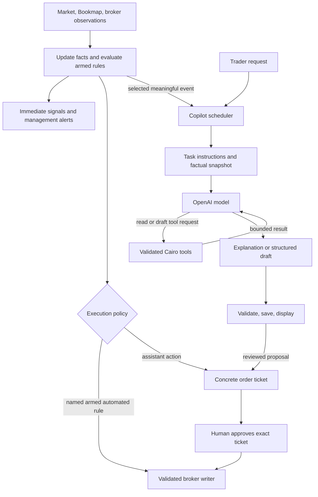

# Why SQLite, and what Cairo's agent harness does

> Earlier rationale retained as background, superseded October 4, 2026: the user requested a live-first MVP **without Cairo-owned SQLite** and selected OpenCode V2 plus a Cairo plugin. The SQLite recommendation below is no longer the MVP plan; its history/journal requirements were removed. Read [SIMPLIFIED-MVP.md](SIMPLIFIED-MVP.md) for the small file checkpoint/in-memory design and [PLAN-DECISIONS.md](PLAN-DECISIONS.md) for the remaining choices. The custom loop explanation remains explanatory only; OpenCode may keep its own internal runtime storage. The chart now uses Massive REST one-minute snapshots without a Cairo WebSocket; entries are observer-only and exit actions require exact human approval. Older live-candle and automatic-management paths below do not expand this MVP.

Planning explanation, October 4, 2026. Read [the plan comparison](PLAN-COMPARISON.md) for the alternatives. “Bounded OpenAI copilot” describes a proposed operating model, not a product/library name. Nothing in this document has been implemented.

## 1. Why SQLite belongs in a small local app

Cairo needs to remember the state that belongs to Cairo: which tradebook version was used, which plan was attached, what signal was observed, which ticket was approved, which action was attempted, and why a management rule fired. A broker account query can recover current positions and orders; it cannot recover all that intent and reasoning.

SQLite is an embedded local database. It needs no database service, cloud account, or separate installation for the user. That makes it a fit for a personal desktop application, rather than an investment in scale. See [SQLite's description](https://sqlite.org/about.html).

### Concrete uses

| Data | Why persist/query it? |
| --- | --- |
| Published tradebook/plan snapshots | A live edit must not erase the rules that governed an earlier signal or position. |
| Signal episodes/evidence | Merge repeated Bookmap episode updates; restore the timeline after restart. |
| Action intents/approvals | Preserve exactly what was approved, submitted, rejected, or left unknown. |
| Orders/fills/position attachments | Reconcile broker facts without losing plan/tier attribution; deduplicate repeated reads. |
| Management events | Explain which rule acted, using which facts and position quantity. |
| Copilot conversation/runs/proposals | Continue useful conversations and identify stale drafts. |
| Journal metadata | Query a day/trade and link its plans, actions, fills, and notes. |

For example, an entry is approved and submitted, then the app closes before the response is saved. On restart Cairo must recover the pending intent, reconcile with Schwab, and display an unresolved result if identification is ambiguous. It must not create a fresh copy simply because the chat history or in-memory flag disappeared. SQLite supports the local durable intent record; broker reconciliation supplies the external facts.

Another example: an open position uses tradebook v3. The trader and AI draft v4. Cairo should continue explaining the position against v3 until the user accepts a management update, and the journal should retain the version used at each decision.

### Why not only JSON files?

Files are useful for human editing and exports. They become awkward when several related records must update together: an intent state, its approval/action event, and the local projection. An interrupted set of separate file writes can leave an inconsistent collection. SQLite can group those local changes into a transaction. Its [transaction documentation](https://sqlite.org/transactional.html) describes atomic commit/rollback behavior.

This does not make a SQLite transaction atomic with a Schwab network request. Save the intent before sending; record the response afterwards; reconcile any gap. Neither plan can honestly promise exactly-once broker execution from a local database alone.

An observer-only prototype could use memory plus JSON/JSONL. Once approvals, broker submissions, restart recovery, and journaling are in scope, SQLite is less work than building a bespoke durable file database with indexes, deduplication, and transaction recovery.

### Keep the implementation small

Use one Cairo database with a few tables at the milestone that needs them. The original specification's table inventory describes the eventual MVP, not a requirement to create every table in M0. Start with version snapshots, events, and intents as those features arrive; add account/fill and conversation storage when used. An ORM is optional, not a requirement.

Use a simple division:

- **Readable files:** authored tradebooks, daily plans, journal exports, configuration.
- **SQLite:** published snapshots and operational relationships/state/history.
- **JSONL/NDJSON:** optional high-rate recorded inputs and portable event exports.

The live evaluator works in memory. Do not query SQL for every tick or synchronously write every quote/depth update. Persist important transitions and batch/cache lower-frequency bars; send raw recording to the asynchronous recorder. The app should remain useful if raw recording is disabled.

Both plans choose SQLite. Their adapter choice differs: mine first proves built-in `node:sqlite` in the actual Electron runtime; the other uses `better-sqlite3`. Decide that through an early packaged-runtime check. It does not change why durable local state is needed.

## 2. What an agent harness is

The model produces text, reasoning output items, and tool-call requests. The harness is the application code around it that decides:

1. When to run the model and what task it is handling.
2. Which instructions, facts, history, and tools it receives.
3. Which requested tools to execute and how to return results.
4. Whether to continue, stop, cancel, or wait for user input.
5. How to validate, persist, and display the result.
6. How a proposal reaches the separate approval/execution workflow.

For Cairo, these components live in the local TypeScript runtime. The model inference happens through OpenAI. Calling this local does not mean inference is offline.

## 3. The two loops

The market loop operates continuously while the app is running. It normalizes inputs, maintains features/account projections, evaluates supported rules, and publishes evidence immediately. The copilot loop runs for a user request or a meaningful event. Neither a pending explanation nor a long research request holds up deterministic evaluation.

This is still an AI-native product: AI helps turn the trader's ideas into a usable tradebook, finds ambiguity, retrieves context, interprets evidence, and proposes changes. Publishing/arming converts reviewed measurable clauses into runtime rules. A genuinely discretionary clause remains human-confirmed or advisory until its required interpretation/detector is defined.

## 4. One copilot run, step by step

Suppose Bookmap emits a bid-reappear episode for the selected stock.

1. **Evaluate immediately.** The engine checks the armed tradebook's available hard clauses: pattern eligibility, source mode/readiness, key level, session window, and scoped human confirmations. It emits ready/candidate/unknown with evidence as appropriate. Missing context is visible.
2. **Schedule interpretation.** A material new episode can start a monitor run. Repeated score updates merge into that episode instead of spawning an explanation for every update.
3. **Build context.** Supply the published tradebook, daily plan, recent pattern/wall evidence, relevant prices with source/time, data quality, and any attached position/working orders. Include compact conversation history.
4. **Call the model.** The monitor profile receives read tools such as `get_plan`, `get_market_snapshot`, `get_bookmap_context`, and `get_position`.
5. **Execute requested reads.** Cairo validates a completed tool call, executes its local handler, and returns a bounded result linked to that call. It preserves the response items required for continuation. The model can ask for additional facts or finish. This follows the [official function-calling workflow](https://developers.openai.com/api/docs/guides/function-calling).
6. **Validate the result.** Check evidence references and whether the relevant tradebook, plan, or position changed. A result based on old state remains readable as historical; it cannot silently update a newer policy.
7. **Display or propose.** The model may explain why the episode fits, identify a missing clause, or save a draft proposal. A completed explanation is not a broker fill or an applied plan.
8. **Route actions separately.** In assistant mode, an applicable proposal becomes an exact engine-generated ticket. The user approves its details; the engine revalidates and submits. In automated management, a named already-armed deterministic rule can act independently of this model run.

For the personal Gap Give and Go, the context carries its either-side-of-VWAP permission and LOD stop discipline. The model should not reinterpret a generic breakeven example as a reason to move that stop. Likewise, if the bid-reappear observation cannot prove the narrative “price never gets below” clause, the copilot should identify that gap rather than claim the entire setup is confirmed.

## 5. What “bounded” means

Bounds are enforced by Cairo code, not just by asking the model to be careful.

| Boundary | Initial proposal |
| --- | --- |
| Trigger frequency | Meaningful setup/fill/management events and user requests; coalesce episode updates. |
| Model turns | At most four provider turns for a monitor/manager run. |
| Tool calls | At most eight executed calls per such run. |
| Time | A 30-second run deadline, with cancellation and a visible unfinished/failed outcome. |
| Tool output | Bounded bars/events/context; request more deliberately. |
| Effects | Reads and saved drafts/proposals; broker execution uses app commands and policy. |
| Applicability | Published plan/tradebook and meaningful position versions, plus source freshness at action review. |
| Memory | Compact conversation history plus fresh authoritative domain state. |

These are proposed tunable engineering defaults, not measured latency guarantees. Planner/research tasks can have longer budgets. A human taking time to approve a ticket does not keep the model run open: persist the proposal/ticket and finish the run. A quote moving is normal; the broker writer rechecks current prices/quantity, while meaningful plan/position changes invalidate stale applicability.

Bounds prevent a circular tool loop, repeated commentary on every tick, stale recommendations being treated as current, and background research crowding out live interaction. They do not prevent the trader from starting a new task or continuing a conversation.

## 6. Five task profiles, not five required parallel agents

| Profile | Job |
| --- | --- |
| Tradebook/planner | Ask about ambiguity, draft clauses/rules, explain coverage, bind a daily plan. |
| Monitor | Explain a detected setup or invalidation against current evidence. |
| Manager | Review an open position and propose a rule-consistent action. |
| Journal | Summarize actual events and discuss process separately from outcome. |
| Research | Draft experiments and later interpret reproducible backtest results. |

The application chooses the profile and relevant tools. One configured model can serve all five. The OpenCode plan expresses similar roles as agent files and reusable skills; the custom plan can express them as versioned instruction modules. Automatic multi-agent delegation is not required by either role list.

## 7. Which parts to implement, reuse, or embed

| Option | Provided runner infrastructure | Cairo still supplies |
| --- | --- | --- |
| Official OpenAI SDK + custom Responses loop | Model API client and streaming primitives. | Task scheduling, tool dispatch/continuation, persistence, budgets, cancellation, domain validation, ticket workflow. |
| OpenAI Agents SDK | Reusable agent loop and SDK workflow features. | Trading context/tools, event scheduler, domain state, approvals/execution policy, packaged app integration. |
| OpenCode V2 plugin/sidecar | Sessions, provider/tool runtime, permissions, skills, compaction, client event interfaces. | Trading engine, plugin adapter, exact ticket/policy mapping, event scheduling, workspace lifecycle, packaging/version integration. |

The [OpenAI Agents SDK documentation](https://developers.openai.com/api/docs/guides/agents/sdk) describes an application-owned deployment/tools/state/approval boundary with an SDK-owned loop. Its [running-agents guide](https://developers.openai.com/api/docs/guides/agents/running-agents) explains continuation and stopping points. That is a practical middle path if custom loop mechanics become unnecessary maintenance.

My original recommendation was the first option, scoped narrowly; the second is a reasonable implementation refinement. The third is a valid alternative if OpenCode's broader workspace capabilities are valuable to Cairo. Whichever runner is chosen, its permission mechanism does not replace Cairo's named trading rules, durable intents, quantity/order checks, or broker reconciliation.

## 8. Small harness acceptance demo

Before a real broker action, demonstrate with a fake provider and broker:

1. A new Bookmap episode triggers one explanation with the correct published context.
2. The model retrieves missing facts through validated read tools.
3. A proposal is saved and displayed without broker writes.
4. User approval produces one exact intent; a duplicate command does not submit twice.
5. A changed plan/position makes the old proposal historical.
6. Tool/time limits stop a looping run with a clear outcome.
7. A stalled or disconnected model does not stop deterministic alerts or named armed management.

This demonstrates the actual Cairo harness contract. It is more useful than proving that a general chat agent can call an arbitrary tool.
