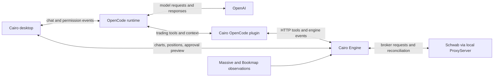

# How Embedded OpenCode V2 with a Cairo plugin works

> Scope update October 4, 2026: this is now the user's selected agent runtime. Cairo's own storage has been simplified to in-memory live state plus necessary authored/recovery files; broad durable trading history, replay, and journaling are deferred. OpenCode can retain its own internal sessions. Read [SIMPLIFIED-MVP.md](SIMPLIFIED-MVP.md) and [PLAN-DECISIONS.md](PLAN-DECISIONS.md); process/UI/broker/market choices in this walkthrough describe the other proposal unless confirmed there. Current charting is Massive REST one-minute snapshots only, leaving the user's WebSocket to Bookmap. Current entries are observer-only and exits require exact-human-approved assistant; automated and entry-submission examples below explain later capabilities, not this MVP.

Planning explanation, October 4, 2026. This walks through [the other plan's architecture](../opencode/01-architecture.md) and [its agent harness](../opencode/03-agent-harness.md). It describes proposed behavior; Cairo has no implemented integration yet. The V2 API details below were checked against current official documentation.

The proposal uses OpenCode as Cairo's ready-made agent runtime. The OpenAI tool loop you already understand still happens, but OpenCode owns the conversation, model requests, tool execution flow, and continuation. Cairo supplies trading capabilities through a plugin and keeps market/account state in its own engine.

“Embedded” has two possible meanings here. The other plan specifically bundles an OpenCode executable and launches its headless server alongside Cairo. A **sidecar** is just that separate local background process. Cairo displays its own charting and chat interface and connects to the server through `@opencode/client`. The official [client documentation](https://opencode.ai/v2/docs/build/client) describes this connection. Separately, the [embedded SDK](https://opencode.ai/v2/docs/build/sdk) supports running an OpenCode host inside an application process; adopting that would change the process arrangement. It is an alternative to the sidecar specified in the other plan.

In the proposed MVP, the responsibilities are:

| Component | Job | Concrete example |
| --- | --- | --- |
| Cairo desktop | Windows lifecycle, charts, chat, tradebook editing, approval cards | Display a signal and the exact order awaiting approval. |
| OpenCode runtime | AI sessions, provider calls, tool loop, streaming, compaction, permission workflow | Send the live-copilot's request to your configured OpenAI model and continue after a tool result. |
| Cairo OpenCode plugin | Connect OpenCode's capabilities to Cairo's engine and workspace | Expose `cairo_plan_read`; forward it to the engine; return the result to OpenCode. |
| Cairo Engine | Data feeds, signals, rules, sizing, positions, drafts, broker actions, persistence | Calculate shares from entry/stop/risk, track fills, execute an armed exit rule. |



The plugin in this diagram is TypeScript loaded by OpenCode. Your existing **Bookmap Java plugin** is a different component: it detects order-flow patterns inside Bookmap. Its observations would reach Cairo through the proposed export/stream bridge. That bridge still needs implementation; the existing Bookmap code currently maintains signals in memory and can serialize them.

When you open Cairo, Electron would create or locate your `%USERPROFILE%\Cairo` workspace, start the engine, and launch the pinned OpenCode executable in that workspace. OpenCode loads its configuration, trading instructions, agent profiles, skills, and Cairo plugin. The plugin discovers the engine's endpoint from the runtime file. The desktop then connects to both services and creates or reuses a session such as `live 2026-10-04`.

The workspace is useful because you and the AI can inspect the same tradebooks, plans, and journals. OpenCode stores its conversation/session history; Cairo stores trading records and operational state. The model still runs through OpenAI using your configured credential. Bundling the local runtime does not make model inference offline.

The plugin's central job is to give the model trading tools. For example, `cairo_market_context`, `cairo_plan_read`, `cairo_tradebook_read`, and `cairo_account_snapshot` retrieve facts. `cairo_order_stage` asks the engine to build a concrete draft. `cairo_order_submit` requests submission of that draft. OpenCode V2 supports registering domain tools through its [plugin API](https://opencode.ai/v2/docs/build/plugins).

For a read, the path is straightforward:

```text
Model requests cairo_plan_read({ symbol: "INTC" })
    -> OpenCode dispatches the registered tool
    -> Cairo plugin calls the engine's plan endpoint
    -> Engine returns the saved plan and relevant structured fields
    -> Plugin returns that result to OpenCode
    -> OpenCode gives the tool result to the model
    -> Model requests another tool or finishes its answer
```

The plugin should remain a thin adapter. Trading arithmetic belongs in the engine. A tool description tells the model what it can request; the engine defines what that request means and whether it is valid.

The other plan uses several terms for different pieces of this behavior:

| Piece | Meaning in Cairo | Example |
| --- | --- | --- |
| Agent profile | Instructions and permissions for a particular job | `live-copilot` checks an entry; `trade-manager` reviews an open position. |
| Skill | Reusable instructions for carrying out a task | `manage-trade` explains how to review your tier-management rules. |
| Tradebook | The trader's setup and management definition | Which Bookmap patterns qualify, context gates, invalidation, and tier rules. |
| Tool | A callable program capability | Retrieve signals, validate a tradebook, stage an order. |
| Hook | Code that runs at a defined runtime boundary | Add fresh trading context before a model call; check an action before permission approval. |
| Command | A shortcut into a workflow | `/manage INTC` starts a management review. |

The five profiles correspond to your five task types: premarket planner, live copilot, trade manager, journalist, and researcher. They can share one OpenAI model. Profiles define behavior, rather than requiring five models continuously running. The official [agent documentation](https://opencode.ai/v2/docs/agents) distinguishes primary profiles from delegated subagents. In the supplied plan, research delegation is later work.

Skills hold reusable workflow instructions; OpenCode can load them when relevant. The official [skills documentation](https://opencode.ai/v2/docs/skills) describes this instruction-loading mechanism. A Bookmap-patterns skill lets the AI understand and explain your catalog. Pattern recognition still comes from the Bookmap detector and Cairo's supported engine rules. Adding a prose setup to a skill does not create a new executable detector. A new setup can become advisory immediately; automatic detection needs measurable conditions and a supported data source/evaluator.

A context hook gives the live copilot a compact engine snapshot before each model step: current symbol, mode, prices with timestamps, plan, recent signals, positions, and working orders. Tools fetch more detail if needed. This also keeps an old conversation summary from becoming the authority for the current position. The V2 plugin contract explicitly runs the context hook for tool-driven continuations as well as the initial agent request. [Plugin hooks](https://opencode.ai/v2/docs/build/plugins)

For your live workflow, the AI can also react before you type anything. The plugin subscribes to **Cairo Engine events** and sends meaningful events into the live session as synthetic messages. This engine subscription is separate from OpenCode's own event stream.

The current [V2 session API](https://opencode.ai/v2/docs/api) states that admitting a synthetic message schedules agent-loop execution unless `resume` is false. Thus a new qualifying Bookmap episode can wake the copilot. Synthetic messages skip the user-prompt hook, but the resulting model request still receives the context hook. They are machine-originated input, not a grant of trading authority.

This creates a concrete event path:

```text
Bookmap observation -> Cairo Engine signal episode
    -> Plugin filters/deduplicates the event
    -> OpenCode admits synthetic session input and schedules the agent
    -> Fresh engine snapshot is supplied
    -> Model reads the tradebook/plan and explains or stages an action
```

Cairo must choose which events deserve an AI run. A new eligible episode, a fill, or a material invalidation can qualify. Repeated score updates should merge into the episode. Every tick should update the chart/engine, rather than create a model request. Session admission and an eventual model response are asynchronous; an old event must be rechecked against current facts before any action. For events that should be recorded without waking the model, the documented synthetic API offers `resume: false`; verify the pinned plugin's input type and delivery behavior in the initial integration spike.

Here is an assistant-mode entry from beginning to end, using your Bookmap workflow. This is an illustrative workflow, not a recommendation to trade a specific signal.

1. **Detect:** Bookmap emits an offer-wall-breakout observation. The engine attaches it to a signal episode and evaluates the available tradebook conditions against the current plan.
2. **Wake:** The plugin sends the meaningful event into today's live OpenCode session. Alternatively, you click Explain or ask whether it fits the plan.
3. **Inspect:** OpenCode runs `live-copilot`. The model receives current context and requests tools for the signal evidence, plan, tradebook, and account as needed.
4. **Stage:** If an entry is appropriate under that plan, the model requests `cairo_order_stage`. The engine computes and saves a draft containing side, quantity, entry, stop, targets, risk, and expiry. This step does not place an order.
5. **Request permission:** The model requests `cairo_order_submit({ draftId })`. The plugin's submission path must invoke the corresponding OpenCode permission check and identify the exact draft. Assistant mode resolves to `ask`.
6. **Review:** The desktop receives the permission request, obtains the engine's draft preview, and shows an approval card. You approve once or reject. OpenCode's [permission documentation](https://opencode.ai/v2/docs/permissions) defines the waiting and reply behavior.
7. **Submit:** After approval, the plugin calls the engine. The engine verifies the approved ticket, current policy, position, working orders, and freshness again, then submits through the plan's local ProxyServer to Schwab. A stale or changed ticket requires a new decision.
8. **Reconcile:** The engine tracks the broker result and subsequent fills. The desktop updates the chart/account; OpenCode gets the tool result and explains what happened. Submission acceptance and a confirmed fill remain distinct states.

OpenCode provides the generic permission interaction; Cairo supplies the trading meaning of that approval. The implementation must bind approval to the exact draft and record the outcome in the engine. A generic “allow this tool” decision cannot stand in for approving an arbitrary later ticket.

Your three modes then fit the same architecture:

| Mode | AI-requested broker actions | Continuous engine behavior |
| --- | --- | --- |
| Observer | Blocked; reads, explanations, and draft previews remain available. | Detect, evaluate, and recommend. |
| Assistant | Ask for approval of the concrete action. | Detect/evaluate and prepare management recommendations. |
| Automated management | Entries remain approved initially; management is limited to explicitly armed rules. | Execute eligible named rules directly through the broker writer and report results. |

For example, once a trade is filled, an armed breakeven-stop rule can follow this path:

```text
Live facts -> Engine evaluates named rule -> Validate order change -> Schwab
                                                   |
                                                   -> Notify desktop and OpenCode
```

The AI can explain the change afterwards. Detection and protective execution continue if the OpenCode sidecar is busy or unavailable. Assistant-mode changes still wait for human approval. The other plan makes autonomous management a later/stretch milestone; this separation describes its intended behavior when that stage is implemented.

Compared with the custom OpenAI loop, the work being reused is conversation/runtime infrastructure: provider integration, sessions, continuation, streaming, compaction, skills, and the permission interaction. Cairo still needs its trading engine, UI, plugin tools, tradebook semantics, event filtering, exact-ticket approval binding, broker reconciliation, and Windows packaging. This is a viable way to build the harness, particularly if the file-and-skill workspace matters to the product.

Before implementation, the other plan's M0 spike should prove a small complete chain: launch the actual pinned Windows V2 runtime, load one Cairo tool, inject current context, wake a session from one engine event, stage a mock ticket, approve it through the client, and reach a mock engine submission exactly once locally. Verify custom permission action mapping and mode changes rather than treating configuration sketches as tested code. The supplied executable filename and version range are packaging proposals; we have not validated an installed Cairo bundle.

Reconnect handling also needs explicit wiring. OpenCode's [client documentation](https://opencode.ai/v2/docs/build/client) says subscriptions do not replay events or reconnect automatically. Cairo should re-subscribe, refresh session/pending-permission snapshots, and refresh engine drafts/account state after a disconnect. Conversation storage and the engine's durable trading records make that refresh possible.

For the broader design differences, see [PLAN-COMPARISON.md](PLAN-COMPARISON.md). For the custom loop and local storage rationale, see [HARNESS-AND-STORAGE.md](HARNESS-AND-STORAGE.md).
