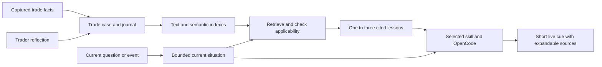

# Cairo per-trade knowledge base plan

October 5, 2026. Design proposal only; the journal store, capture ledger, retrieval service and UI below are not implemented.

## Decision

Build a local case library with automatic evidence capture and a short trader-authored journal. Preserve original records; generate search indexes, extracted lessons and optional classifications from them. A trader should not have to maintain a growing taxonomy.

The daily obligation is to describe the decision and learning in ordinary language. Tradebook and Bookmap pattern links are the two useful anchors. Inherit them when Cairo has a reliable association; otherwise offer suggestions and allow unknown. Do not require a pattern for a trade that had none.

New concepts should normally require a new search or a background extraction pass, rather than manual retagging. An old record that never captured the relevant information must remain unknown: no indexing technique can recover an observation that was never recorded.

## Fit with Cairo

The user's three areas remain useful:

| Area | Responsibility |
| --- | --- |
| Tools | Read broker/market facts, search cases, read source evidence, propose journal changes |
| Skills | Procedures such as managing a trade, journaling it, or reviewing recurring lessons |
| Knowledge | Current tradebooks and pattern definitions, historical trade cases, personal lessons |

Two supporting areas complete the architecture: durable state/evidence capture, and invocation/trigger coordination. Retrieval belongs in Cairo's context construction. OpenCode continues to run the model and domain tools; it should not have to reinvent indexing or scan the whole journal directory on every question.

Existing foundations:

- `TradebookStore.mts` loads read-only narratives from `Backtest/tradebooks` and binds interpretations to source hashes. Cases can reference the book ID and the revision actually used.
- `BrokerFacts` contains positions, working orders and recent fills. These are inputs to a trade ledger, not a complete persisted trading history.
- `BookmapReceiver.mts` exposes episode identity, revision, detector/config revision, event/receipt times, mode and readiness. Its current projection retains at most 400 episodes, with resets clearing state.
- `ManagementTimeline.mts` retains at most 100 timeline entries in the engine snapshot. Persisting a journal from this buffer after the session is not sufficient for reliable history.
- The three current slash skills provide a natural initial integration point for related lessons.

## 1. Keep three kinds of knowledge distinct

1. **Tradebooks and pattern definitions:** the current strategy and vocabulary. These remain in their existing configured source folders. Include referenced shared Markdown documents in the searchable knowledge view, with bounded local-link traversal and explicit allowed roots. External links remain references unless separately imported.
2. **Trade cases:** what was available, what the trader intended, what happened, and what the trader learned in a particular episode.
3. **Reusable lessons:** searchable excerpts or carefully derived statements linked back to cases. A lesson can describe a personal observation without becoming a strategy rule.

Keep factual history, trader interpretation and proposed improvement separate. "I should have exited sooner" is a hindsight proposal. It does not prove that an earlier exit signal existed, or that the alternative would have produced the claimed result.

The currently attached, reviewed guidance governs a live position. A retrieved case cannot silently replace it. A recurring insight can be proposed for promotion into a tradebook, but the source remains read-only to Cairo's trading agent and changes follow the existing editing/review workflow.

## 2. The smallest useful daily habit

After trading, show a daily list of automatically captured trades. Open a trade and write or dictate a few sentences addressing:

```text
Why I took this trade:
What actually happened or surprised me:
What I would repeat or change next time, and under what condition:
```

These are prompts, not required form fields. A single paragraph is sufficient. Accept a pasted daily journal covering several trades; use AI to suggest associations to captured cases, asking only when the association is ambiguous. Keep unmatched notes searchable instead of discarding them or forcing a trade assignment.

Prefill symbol, side, dates, fills, referenced guidance and available pattern observations. The trader only supplies reasoning the software cannot observe. Suggest the tradebook/pattern links from explicit guidance, event associations or the journal itself; distinguish confirmed links from AI suggestions. A nearby detector episode is an observed pattern, not proof that the trader used that pattern to enter.

Screenshots are optional. Cairo should attach available captured chart/observation evidence automatically. A screenshot is especially valuable for visual order-flow context that the existing structured feed does not contain; its absence is recorded, not treated as a failed journal.

Target: a few useful sentences per meaningful trade, with occasional correction of an association. Validate the time required with actual use before introducing more fields.

## 3. Capture the evidence before it disappears

Introduce a durable, idempotent capture ledger owned by the engine, independent of AI availability. Record accepted broker changes, fills, scoped Bookmap episodes, plan/guidance revisions and management transitions as they arrive. Never treat a repeated poll as a new event.

Persist source identity and revision, source event time, receipt/availability time, coverage and mode. Use stable scoped deduplication keys; a broker order acknowledgement is not a fill. If capture fails, expose the gap and retry durable jobs rather than presenting a complete history.

Construct a trade episode around account + instrument + direction and confirmed execution history. A flat-to-flat cycle is a useful default, with scale-ins/outs included. Explicitly handle:

- Re-entry as a new case, even when a broker position identifier is reused.
- Reversals split into closing and opening exposure.
- Carry-in positions and activity while Cairo was offline as incomplete cases.
- Missing execution detail, concurrent strategies on the same symbol, or uncertain fill associations as ambiguous; permit merge/split correction without changing the underlying event ledger.

Capture bounded evidence at entry, material management changes and closure. Store actual available chart snapshots and relevant episode windows, not every tick or a claim of continuous Bookmap reconstruction. Preserve original observation revisions and source mode. A source reset must not delete previously persisted evidence.

Current Cairo projections cannot reconstruct a full historical order-flow stream. Initial case quality therefore depends on when capture begins and what each feed supplies. Historical broker imports can enrich execution history later; they cannot manufacture missing intent or Bookmap evidence.

## 4. Use inspectable sources and rebuildable indexes

Proposed default folder: `C:\Users\lingr\cairo\knowledge`, configurable by an absolute knowledge-directory path on each machine. Personal journals belong outside the application source repository.

```text
knowledge/
  cases/2026/10/<case-id>/
    trade.json            # Machine-maintained identity, execution links and coverage
    journal.md            # Original trader-authored narrative
    evidence/             # Captured chart/context files and optional images
  daily/                  # Original unmatched or multi-trade daily notes
  ledger/                 # Durable source-event storage and revision history
  concepts/               # Optional reusable search concepts, aliases and definitions
  derived/                # Versioned extracted lessons and classifications
  index/                  # Rebuildable SQLite text/metadata/embedding index
```

The precise ledger file format is an implementation decision; a transactional store is preferable to rewriting one enormous JSON file. The folder contract matters more than exposing database internals to traders.

Canonical source records and their revision history are authoritative. AI derivations and search caches are replaceable. Each derived item records source ID/hash, source excerpt, extraction schema/version, model/prompt version and creation time. Human corrections supersede an inference and survive reindexing.

Source edits trigger atomic revisions and index jobs. Detect direct Markdown edits by hash. Search only index entries matching the current source generation; mark pending work, retain a direct-source fallback, and never silently cite deleted or superseded content. Back up canonical sources and ledger; the index can be rebuilt. Archive captured source revisions needed to understand older cases when their tradebook or pattern definition changes.

Account identity is useful for local reconciliation but unnecessary in an embedding. Keep credentials out of records and model inputs; use stable local account references. Export selected cases without unrelated account data. Add multi-user isolation to the storage/query contract from the beginning, even if the first implementation has one local trader.

## 5. Derive useful search units without making new rules

Run journal enrichment after saving, in a background queue. Create small search units at meaningful boundaries: entry reasoning, stop management, target management, execution mistake, and a next-time observation. Retain surrounding context and links to the complete case.

A derived lesson should have:

| Field | Purpose |
| --- | --- |
| Source case, revision and excerpt | Make the statement inspectable and correctable |
| Situation and decision stage | Locate where the lesson applies |
| Observed facts versus trader interpretation | Prevent an inference becoming a broker fact |
| Proposed next-time behavior | Capture the actual learning, if the journal provides it |
| Applicability and exceptions | Preserve stated conditions rather than creating universal rules |
| Tradebook/pattern links and their origin | Match explicit anchors without forcing classifications |
| Missing evidence, status and supersession | Explain gaps, disputes or later revisions |

Use nullable fields. Do not invent a stop price, risk basis, market condition, emotion, confirmation signal or lesson. Index the original journal as well as derived units, so an extraction error or future schema change does not hide the original wording.

A saved human journal can be searched immediately. AI-derived items can enter candidate retrieval with their provenance, without requiring approval of every generated field. They must be checked against the cited source before becoming a live cue. New strategy rules and stronger generalizations require a separate review.

Realized P&L, commissions and risk multiples need sufficient execution and risk evidence. Leave unavailable calculations unknown. A profitable outcome does not establish good process, and a losing trade does not establish a bad setup. Support repeated-pattern claims with actual case counts and comparable opportunities, not a list of selected winners or losses.

## 6. How similarity search works

Build one bounded current-situation description from the question, active symbol/position, selected skill, attached tradebook revision, user-stated intent and available observations. Include only facts known now; preserve explicit unknowns.

An example query might describe: a short trade under a gap-fade plan, an observed bid-reappearance episode, and a question about whether the original entry lacked confirmation. The symbol helps find personal examples, but another ticker may offer a more relevant lesson. P&L is not a similarity criterion for the decision itself.

Search three complementary paths:

1. **Structured anchors:** tradebook, pattern, side, decision stage and supported context. User/tenant visibility is a hard boundary. Anchor matches are usually boosts; otherwise older unclassified journals and useful cases under a related strategy would disappear. Use hard exclusion for an explicit applicability conflict.
2. **Text search:** preserve exact strategy names, pattern vocabulary, prices mentioned by the user and distinctive phrasing. SQLite FTS5 supplies local full-text search and BM25 ranking; keep it synchronized with source revisions. [SQLite FTS5 documentation](https://www.sqlite.org/fts5.html).
3. **Semantic search:** embeddings represent the meaning of the situation and the journal passage. This can nominate "acted before confirmation" for a query about "entering too soon", without an `early-entry` tag. Similarity supplies candidates; it does not prove that two trades are equivalent.

Merge these candidate lists by rank, rather than adding incompatible raw text/vector scores. Reciprocal rank fusion is a reasonable starting point to compare against simpler baselines, not a guarantee of the best result for this corpus. Hybrid retrieval and rank fusion are documented in [Elastic's hybrid-search guide](https://www.elastic.co/docs/solutions/search/hybrid-search) and [RRF reference](https://www.elastic.co/docs/reference/elasticsearch/rest-apis/reciprocal-rank-fusion). This recommends a retrieval method, not deployment of Elasticsearch.

For an initial configuration, retrieve roughly 20–40 candidates, compare a bounded subset against the current situation, then return at most three distinct useful lessons. Deduplicate overlapping passages from the same case. Include counterexamples or exceptions when they materially change applicability. A short reranking model step is optional; its judgments must cite supplied facts and cannot establish missing observations. Tune candidate limits and thresholds using real examples.

Return an inspectable match explanation: shared tradebook/pattern, decision similarity, differences, source excerpt, and unsupported conditions. If the match depends on a condition that is unknown now, qualify it or omit it. If nothing is sufficiently relevant, return no match. Do not force a historical analogy.

Use a separate embedding adapter and versioned embedding generation. A chat model is not an embedding model. Embed documents and queries compatibly, cache by content hash, and rebuild embeddings in the background when changing model. Do not mix incompatible vectors. Run retrieval/index jobs outside the trading engine's critical event loop.

Start with local SQLite metadata/FTS and a replaceable vector-search adapter. For a small corpus, scanning cached vectors in a worker may be enough; measure it. Add an approximate-neighbor index or a service only when measured corpus size, latency or multi-user requirements justify it. Select and verify the SQLite/vector runtime against Cairo's Electron Windows package during implementation.

## 7. Make new concepts cheap

Suppose six months later the trader wants to investigate "entry before confirmation". Three increasing levels of work are available:

1. Search the existing raw and derived text with a semantic description and optional wording aliases. No relabeling is needed.
2. Save an optional concept document describing what qualifies, exclusions, synonyms and examples. This becomes a reusable query and evaluation definition.
3. Run a versioned background extractor over existing journals and evidence to materialize classifications for analytics or faster filtering. Record supporting excerpts and unknown cases; do not edit original journals.

A new concept should therefore cost one definition and perhaps an automated batch job. Only genuinely ambiguous, high-value cases need human attention. Avoid large mandatory tag dictionaries or a generic metadata form with dozens of empty fields.

For example, an old journal may explicitly say "I acted on the first weakening before my planned confirmation". That sentence remains discoverable before anyone creates a name for the mistake. If a new concept asks whether the entry occurred above VWAP and neither narrative nor captured price/indicator evidence establishes it, the old case remains unknown.

## 8. Feed a small evidence packet into live AI



Initial integration: explicit chat questions and the three existing skills. Cairo constructs the scene and retrieves related lessons before the answer. Add domain tools such as `search_trade_knowledge` and `read_trade_case` for requested follow-up searches; the server enforces scope and allowed paths rather than trusting a model-supplied account or filename.

Keep the injected memory packet small, initially around 1,000 tokens, containing source IDs/revisions, exact supporting excerpts, match reasons, differences and status. Do not send the complete journal history. Refresh current broker/source facts independently of the historical packet.

The live answer follows the existing brief-response preference. Show case links and the match explanation in an expandable evidence area, not a long chat essay. An illustrative cue might be "Prior lesson: confirm the entry condition first." It must be supported by the retrieved journal and qualified by the current situation; this is not a new universal entry rule.

Prefetch when the selected tradebook/focus changes or a meaningful new position appears. Cache by scene, question intent and index generation; invalidate on relevant facts/guidance changes. Bind pending work to its original scope, and discard a late result if the focused position changed. Retrieval failure or latency must not stall broker reconciliation or imply that the trade is safe. Continue with current guidance and expose that historical context was unavailable.

Treat recalled journals, OCR and annotations as evidence, not instructions that override skills or tool permissions. Cases never approve orders or activate guidance.

## 9. Add triggers after retrieval is useful

First capture automatically and retrieve on explicit questions. Later add opt-in retrieval on a confirmed entry, a supported relevant pattern, or a material management event. Each trigger asks a specific question, for example whether a relevant prior lesson changes the interpretation of the current reviewed plan.

Repeated polling does not trigger a model call. Coalesce repeated scene updates and show a proactive cue only for a relevant material change. A position-close event can queue an end-of-day journal draft without interrupting the trader. Capture and indexing do not require proactive chat notifications.

Keep the automatic path behind retrieval-quality and notification-frequency checks. Repeated weak analogies are worse than an empty evidence panel during live trading.

## 10. Divide coding and documentation work deliberately

| Work | Cairo/code responsibility | Trader documentation responsibility |
| --- | --- | --- |
| Trade record | Capture, reconcile, deduplicate, group and persist evidence | Correct an occasional ambiguous grouping |
| Daily journal | Prefill facts, accept free text/voice, suggest associations | Explain intent, surprise and next-time condition |
| Strategy/pattern anchors | Inherit reliable links; store origin and revisions | Confirm or select when useful; allow unknown |
| Search lessons | Extract, index, retrieve, cite and track supersession | Correct a misleading interpretation when encountered |
| New concepts | Expand queries or batch-extract historical records | Describe the concept once if a reusable definition is needed |
| Reusable strategy change | Assemble a reviewable proposal with source cases | Decide whether to promote it into the existing tradebook |
| Search evaluation | Replay scenes, measure ranking/latency and catch regressions | Judge a small sample and provide occasional relevance feedback |

Create only three lightweight documentation resources initially:

- **Daily journaling guide:** the three prompts, one realistic example, and an explanation of missing evidence versus hindsight. This is a short page, not a new reporting obligation.
- **AI journaling/extraction instructions:** source fidelity, what may be inferred, how to preserve uncertainty and how to split a paragraph into supported search units. Implement reusable journaling/review procedures as skills; keep storage, schema validation and arithmetic in code.
- **Strategy/pattern reference conventions:** stable identity, aliases and source revision. Reuse existing documents first. Ask for additional authored definitions only where recognition/applicability is genuinely undocumented. AI can draft missing definitions for trader review.

Do not ask the trader to rewrite all tradebooks, describe every screenshot, approve every inferred keyword, manually maintain vectors, or retag all previous cases.

## 11. Deliver in useful increments

### A. Durable cases and easy journaling

Code: configurable knowledge root, capture ledger, episode grouping/coverage, source revisions, daily trade list, Markdown journal editor and source text search. Introduce stable references to the existing tradebooks/patterns. Include export/backup and index-rebuild behavior.

Trader work: journal the next trades normally. Link the intended strategy and pattern when known. Do not create a historical backlog requirement; offer selective import of valuable existing notes.

Acceptance: a journal and its captured facts survive restart; fills and episodes do not duplicate; an incomplete case stays visibly incomplete; editing a journal updates search; no account secrets enter the source folder.

### B. Similar-case retrieval in current chat

Code: background lesson extraction, embedding adapter, hybrid ranking/applicability checks, bounded evidence injection and expandable source links. Integrate the three existing slash skills and ordinary scoped questions. Use stage A and B together as the first useful live-memory release.

Trader work: provide a small set of representative cases as they accumulate and judge roughly 20–30 saved question/situation examples once. Include misleading near-matches and situations with no useful precedent. Later use simple relevance feedback when necessary.

Acceptance: different wording and different tickers can retrieve the right lesson; unknown anchors do not hide a relevant journal; explicit conflicting conditions are surfaced; unsupported similarity yields no match; the live response stays short and sources are inspectable.

### C. Extensible concepts and reviewed learning

Code: concept definitions/aliases, background re-extraction with job resume, derivation correction/supersession, review of recurring lessons and tradebook promotion drafts. Add opt-in triggers after measuring relevance and noise.

Trader work: occasionally review useful recurring observations and approve desired strategy-document changes. Define a new concept only when it has continuing value. No mandatory weekly paperwork.

Acceptance: adding a concept makes relevant historical notes discoverable without changing their original content; model/schema changes rebuild derived indexes; human corrections survive; rejected lessons stop surfacing.

## 12. Evaluate relevance and temporal honesty

Save a small versioned evaluation set of real questions and captured scenes, expected relevant cases, known conflicts and no-match examples. Compare anchors-only, text-only, semantic-only and hybrid retrieval. Measure relevance among the few displayed results, missed important lessons, unsupported assertions, source traceability, retrieval latency, and whether journaling remains lightweight.

Time-based replay must only access cases/journal revisions available before the evaluated decision. Preserve both event time and knowledge availability time. Do not allow that trade's eventual outcome, later annotations, or later-written journal to leak into its earlier decision scene. Keep example selection chronological and include representative unprofitable/profitable and well/poorly executed cases.

Retrieval scores are not calibrated probabilities of applicability or trading success. A single anecdote is a useful reminder, not proof that a strategy works. Stronger comparative claims require a separately designed analysis with appropriate opportunity data.

Record each invocation's scene hash, retrieved source revisions, index/model generation and displayed lesson IDs for debugging. Start with measured latency budgets and a no-memory fallback; tune on the actual Windows runtime rather than promising performance from an index choice.

## Recommended first scope

Implement durable capture, the simple daily journal and hybrid retrieval for the existing three trading skills. Keep two optional inherited strategy/pattern links, preserve original notes, and return at most three cited lessons. Defer a large tag taxonomy, a graph database, exhaustive tick recording, fine-tuning and proactive pattern alerts until real use demonstrates the need.

The enduring investment is the trader's explanation of what they saw, why they acted and what they would change. Cairo should supply the bookkeeping and turn those explanations into reusable context.
