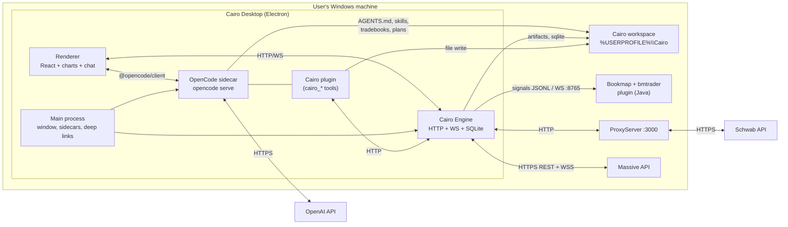

# Cairo — System Architecture

This document describes how the pieces fit together and how each one maps onto OpenCode V2's
architecture. Read `00-decisions.md` first; this doc assumes those decisions.

---

## 1. Goals and non-goals

**Goals (MVP).**

1. A Windows desktop app where a trader watches a small watchlist, sees Bookmap and candle signals
   against a written tradebook, and manages live trades with AI help.
2. The tradebook is a first-class, editable artifact shared by human and AI.
3. Observer and assistant modes work end-to-end; the agent can never place an order without an
   explicit approval flow.
4. Deterministic guardrails: order arithmetic (sizing, stops, R, limits) is computed by the engine,
   never by the model.
5. Everything runs locally with the user's existing Massive, Schwab and OpenAI credentials.

**Non-goals (MVP).** Heatmap rendering, backtesting UI, journaling polish, auto entries, multi-user,
cloud sync, mobile, Linux/macOS packaging, order-book reconstruction, options/futures/crypto.

**Design principles.**

- *Engine owns truth; agents advise.* Every number an agent uses comes from an engine tool response.
- *Files are the interface between human and AI.* Tradebooks, plans, journals are readable text.
- *Approvals are the control plane.* An action either matches an explicit allow rule or it asks.
- *Latency is bounded.* Detection and management rules run on ticks in the engine; the LLM is
  asynchronous and never sits between a tick and a protective action (except approvals in assistant
  mode, by design).
- *Vendor, don't couple.* Trading logic is copied from ViteApp into `trading-core` rather than
  imported across repos.

---

## 2. System context



---

## 3. Components

### 3.1 Cairo Engine (`packages/engine`)

The single source of trading truth. Node/TypeScript, runs in the Electron main process for MVP and
is independently runnable (`bun run engine:dev`) for tests.

Services:

| Service | Responsibility |
| --- | --- |
| `market` | Massive REST backfill (1m bars, daily bars, trades), live trade WS, 1-minute aggregation via `trading-core` `MarketState`; quote/snapshot and context computation (VWAP, premarket high/low, HOD/LOD, gap, ATR, key levels/zones). |
| `signals` | Signal registry + lifecycle (`detected → armed → triggered → invalidated / expired`). Sources: `bookmap` (JSONL tail / WS), `cairo` (candle detectors: ORB, PMHL break, VWAP reclaim/fail, gap context), `manual` (UI/hotkey capture). Dedupe/update by `episodeKey`. |
| `tradebooks` | Load + zod-validate `tradebooks/*.yaml`, hot-reload on change, expose definitions and parse errors. |
| `plans` | Read/write daily plan files (`plans/YYYY-MM-DD/*.md` + `*.json` sidecar); merge levels into chart/Bookmap views. |
| `risk` | R-based sizing (`R = $1,000` etc. from config), buying-power caps, daily max loss tracking, and the deterministic `validate(intent)` used by permission hooks. Outputs shares, R/share, stop distance, worst-case loss, warnings. |
| `orders` | Order drafts (stage → guardrails → submit), Schwab bracket payloads, modify/cancel/flatten, idempotency keys, optimistic state until broker reconciliation. |
| `lifecycle` | Position/trade tracking from orders + executions; computes R multiple, MFE/MAE (as data allows), state transitions; emits `trade.*` events; feeds journaling. |
| `rules` | Deterministic management-rule evaluation (breakeven stop, partials, invalidation exit, session flat-by). In observer/assistant it emits recommendations; in auto it executes allowed actions itself and notifies the session. |
| `journal` | Trade-close records + markdown generation hooks; workspace file writes. |
| `store` | SQLite schema/migrations, JSONL audit append, runtime file (port + token). |
| `api` | Local HTTP + WebSocket API (sections 5 and 6). |

### 3.2 Cairo plugin (`packages/cairo-plugin`)

An OpenCode V2 plugin loaded from the workspace (`.opencode/plugins/cairo/` or as a package in
`opencode.jsonc`). Responsibilities:

- Register the `cairo_*` tool namespace (section 4 of `03-agent-harness.md`), each tool calling the
  engine API with the runtime token.
- Register agents (Markdown) and commands; provide skills content.
- Register permission rules and a `permission: evaluate` hook that calls `POST /api/risk/validate`
  and `GET /api/config/mode`, attaching human-readable reasons ("buying power cap", "daily loss
  limit reached", "outside session", "kill switch on").
- Register `tool: execute.before/after` hooks for audit and UI feedback.
- Optionally set session-scoped rules when the mode changes (`ctx.permission.rules`).
- Subscribe to engine events and push synthetic messages into live sessions (`session.synthetic`)
  so signals and auto-exit executions appear in the chat timeline.

The plugin is intentionally thin: no trading math, no broker logic. If the plugin process dies,
trading and detection continue.

### 3.3 OpenCode sidecar

- Dev: the globally installed `opencode` CLI (`@opencode/cli@2.x`).
- Packaged: `resources/opencode-cli.exe` copied from the pinned `@opencode/cli` platform package,
  spawned by Electron main with `serve` + `--hostname 127.0.0.1` + a fixed port (default 4096).
- Launched with `cwd = %USERPROFILE%\Cairo`, so the workspace's `AGENTS.md`, `.opencode/agents`,
  `.opencode/skills`, `.opencode/commands`, `.opencode/plugins` and `opencode.jsonc` apply.
- The renderer connects with `@opencode/client` (`OpenCode.make({ baseUrl })`); event stream via
  `client.event.subscribe()`.

### 3.4 Cairo Desktop (`apps/desktop`)

**Main process.** Window lifecycle; spawns/monitors the engine and the OpenCode sidecar; passes
the engine runtime file (port + token) to the renderer via preload; native notifications/sound;
global hotkey for manual signal capture; graceful shutdown.

**Preload.** `contextBridge` exposing only: `engineEndpoint()`, `opencodeEndpoint()`, `appInfo()`.

**Renderer (React).** Panels:

| Panel | Contents |
| --- | --- |
| Chart | One active symbol (typed in; recent list): 1-minute candles + volume + VWAP + premarket high/low + key levels/zones + signal markers + order/execution price lines. |
| Signals rail | Live/recent signals with source badge (BM/Cairo/manual), direction, pattern, quality score, price, time, actions (focus chart, explain, capture). |
| Copilot chat | OpenCode sessions: one live session per trading day plus task sessions; agent/model picker; streaming; tool-call cards. |
| Approvals inbox | Pending OpenCode permission requests rendered as trade approval cards (side, qty, entry, stop, targets, R, worst-case loss, expiry). Approve once / always / reject. |
| Positions & orders | Normalized Schwab positions, working orders, entry/exit brackets, unrealized R; modify/cancel/flatten controls (mode-gated). |
| Plan panel | Today's plan per symbol (markdown + structured levels), edge-of-chart quick levels. |
| Tradebook editor | List/edit/validate tradebooks; diff view; "ask Cairo to revise" action. |
| Mode switch + status | observer / assistant / auto; data feed status; kill switch. |

State management: a small store (Zustand) fed by the engine WS and OpenCode event stream; no
global object soup (the ViteApp `window.HybridApp` pattern is not repeated).

### 3.5 Cairo workspace (`%USERPROFILE%\Cairo`)

Human-facing files, and the OpenCode location. Full tree in `02-data-models.md §7`. Seeded from
`workspace-template/` on first run (never overwrite existing files).

---

## 4. Interfaces

### 4.1 Engine HTTP API (v1)

Base: `http://127.0.0.1:<port>/api`. Auth: `Authorization: Bearer <runtime token>`.

| Method + path | Purpose |
| --- | --- |
| `GET /health` | liveness, version, mode, feed status, session state |
| `GET /config`, `PUT /config` | mode, risk settings, flags, active symbol |
| `GET /watchlist` | active symbol + recent symbols + last context summary (MVP: one active symbol) |
| `GET /market/bars?symbol&tf&from&to` | OHLCV (Massive REST, cached) |
| `GET /market/quote?symbol` | last price, bid/ask (when available), day OHLC, volume |
| `GET /market/context?symbol` | pdc, gap $/%, premarket high/low/volume, HOD/LOD, VWAP, ATR14, levels[], zones[] |
| `GET /signals?date&symbol` | signal history |
| `POST /signals/manual` | manual capture `{symbol, side, pattern, price, note}` |
| `GET /tradebooks` / `POST /tradebooks/reload` | load status/errors; force reload |
| `POST /tradebooks/validate` | YAML body → `{ok, errors[]}` |
| `GET /plans?date` / `GET /plan?date&symbol` | plan metadata / parsed plan |
| `PUT /plan` | write plan markdown + structured sidecar |
| `GET /account` | balance, buying power, positions, open orders, executions |
| `GET /orders?date` / `GET /trades?date` | order and trade-lifecycle histories |
| `POST /orders/stage` | `{symbol, side, qty?, entry{type,price?}, stop, targets[], tradebookId, signalId?, intent}` → `{draftId, sizing, riskCheck, warnings[]}` (no broker call) |
| `POST /orders/submit` | `{draftId}` → `{orderId, status}` (mode-gated; idempotent) |
| `POST /orders/{id}/modify` | `{price?, stop?, qty?}` |
| `POST /orders/{id}/cancel` | cancel |
| `POST /positions/{symbol}/flatten` | market flatten with confirmation |
| `POST /risk/size` | entry/stop/qty inputs → sizing result |
| `POST /risk/validate` | action intent → `{verdict: ok|warn|block, reasons[]}` (used by hooks) |
| `GET /journal?date` / `POST /journal/append` | journal records |
| `GET /events` | server-sent event stream (mirror of WS for simple clients) |
| `WS /ws` | subscribe/unsubscribe channels: `quotes`, `signals`, `orders`, `trades`, `alerts`, `status` |

### 4.2 Engine events

All events: `{type, id, ts, seq, payload}`.

| Type | Payload sketch |
| --- | --- |
| `quote.updated` | `{symbol, last, bid?, ask?, volume, candle}` (throttled to ~4/s/symbol) |
| `signal.detected` / `signal.updated` / `signal.invalidated` | `Signal` |
| `plan.updated` | `{date, symbol, levels[], zones[]}` |
| `order.staged` / `order.submitted` / `order.filled` / `order.canceled` / `order.rejected` | order DTO |
| `position.updated` | position DTO |
| `trade.opened` / `trade.updated` / `trade.closed` | trade record |
| `rule.evaluated` | `{tradeId, ruleId, verdict, proposedAction, executed}` |
| `alert` | `{level, title, body, sound}` |
| `mode.changed` / `killswitch.changed` | `{mode}` / `{enabled}` |
| `feed.status` | `{massive: connected|polling|error, bookmap: file|ws|none, broker}` |
| `audit.appended` | audit line |

### 4.3 OpenCode surfaces used

| Concern | OpenCode surface |
| --- | --- |
| Chat tasks | `client.session.create/prompt/generate/interrupt/wait`; `client.event.subscribe()` for streaming |
| Agent roles | agents (Markdown in `.opencode/agents/`) |
| Trading tools | plugin `ctx.tool.transform` with namespace `cairo` |
| Approvals | permission rules + `client.permission.reply({reply: once|always|reject})` |
| Guardrails | `ctx.permission.hook("evaluate")` |
| Audit + UI hints | `ctx.tool.hook("execute.before"/"execute.after")` |
| Skills | `.opencode/skills/<id>/SKILL.md` |
| Commands | `.opencode/commands/*.md` + plugin `ctx.command.transform` |
| Live context injection | `ctx.session.hook("context")` (inject the latest snapshot only for live agents) |
| Background note | `ctx.session.synthetic(...)` for signal/auto-exit notifications |
| Model/provider | `opencode.jsonc` `providers` (OpenAI native or compatible) |

---

## 5. End-to-end flows

### 5.1 Premarket planning

1. User types the symbol in the app (one active symbol in the MVP; a recent-symbols list is kept).
   Backtest/Firestore watchlist imports are post-MVP.
2. Renderer shows daily + intraday context from `GET /market/context`; chart draws levels.
3. User asks the `premarket-planner` agent (command `/plan SYMBOL`). The agent loads the
   `trade-plan` skill, calls `cairo_market_context`, `cairo_tradebook_list`, `cairo_signal_list`
   (news/levels if present), then writes `plans/YYYY-MM-DD/{symbol}.md` + `.json` via `cairo_plan_write`.
4. The plan sidecar's levels flow into the chart and (P1) are pushed to Bookmap as
   `key_levels_config`-equivalent data through the plugin.

### 5.2 Live signal detection (MVP priority)

1. Engine ingests Massive trades (WS or REST polling). `MarketState` builds 1-minute candles, VWAP,
   HOD/LOD, premarket levels.
2. **Bookmap source:** engine tails `%USERPROFILE%\Bookmap\bookmap-signals\pattern-signals.jsonl`
   (or receives `bookmap_pattern_signal` over `ws://localhost:8765` when T0 broadcast is enabled).
   Each line maps to a `Signal` and updates by `episodeKey`.
3. **Cairo source:** detectors run on each closed minute (and on price crossings for stop-style
   triggers): ORB, premarket high/low break, VWAP reclaim/fail, gap context gates from the active
   tradebook.
4. Engine evaluates the signal against the active tradebook (direction, session window, quality
   gates) and emits `signal.detected` with `plan_ref` and `tradebook_id`.
5. Renderer shows the signal in the rail + chart marker, plays an optional sound.
6. The `live-copilot` agent is notified (synthetic message) and can explain or pre-stage a trade
   proposal. In assistant mode, any proposal goes to the Approvals inbox as an `ask`.

### 5.3 Assistant order flow (MVP priority)

1. Agent (or user) calls `cairo_order_stage` with intent + signal id. The engine:
   - resolves entry/stop/targets from the tradebook when the agent passes only a signal,
   - computes shares via `risk`,
   - runs guardrails (mode, session, daily loss, buying power, max shares, kill switch),
   - returns `{draftId, preview, sizing, warnings}`. **No broker call.**
2. Agent calls `cairo_order_submit {draftId}`. OpenCode checks the permission rule:
   - observer → deny (agent explains why);
   - assistant → `ask` → Approvals inbox card appears (fetched draft preview from the engine);
   - auto → still `ask` for entries.
3. On approve, plugin executes `POST /orders/submit {draftId}` with an idempotency key; engine sends
   the Schwab bracket via ProxyServer and stores the order; UI shows the working bracket.
4. Reject → the engine marks the draft rejected and appends an audit entry; the agent receives the
   rejection and can revise.

### 5.4 Trade management

1. `lifecycle` tracks fills from broker reads and derives the open trade (entry avg, stop, size,
   R/share, R multiple).
2. `rules` evaluates tradebook management rules on each quote/closed minute (throttled):
   `move stop to breakeven at +1R`, `partial at target`, `invalidation exit`, `flat_by 15:55`.
3. Observer/assistant: `rule.evaluated` → UI recommendation + agent message; agent can call
   `cairo_order_modify` / `cairo_position_flatten` (assistant: `ask`).
4. Auto (M4): engine executes the pre-validated action directly, writes audit, emits
   `trade.updated` and a synthetic note; the kill switch turns auto execution off instantly.

### 5.5 Journaling (lightweight MVP)

1. On `trade.closed`, engine writes `journal/YYYY-MM-DD/{symbol}-{tradeId}.json` with fills,
   computed R, hold time, plan/tradebook/signal references.
2. `/journal` command runs the `journalist` agent to produce the markdown review using the
   `trade-review` skill (reading the tradebook and plan). Post-MVP: screenshots and batch reviews.

---

## 6. Mode enforcement (defense in depth)

```
agent tool call
   │
   ├─ 1. OpenCode permission rules (agent + session scope)  → deny / ask / allow
   │        ├─ deny  → tool never runs
   │        └─ ask   → Approvals inbox → user replies (once/always/reject)
   │
   ├─ 2. permission: evaluate hook → engine POST /risk/validate
   │        → effect can be downgraded (allow→ask, ask→deny) with a reason
   │
   └─ 3. tool executes → engine endpoint → engine re-checks mode + guardrails
            → refuses if inconsistent (authoritative)
```

Kill switch: `PUT /config {killSwitch: true}` + UI button/hotkey. Engine refuses all mutating
endpoints except cancel/flatten (which still require their normal approval in observer/assistant);
OpenCode rules for auto are re-scoped to `ask` on the next mode sync.

---

## 7. Repository layout and package responsibilities

| Path | Package name | Contents |
| --- | --- | --- |
| `apps/desktop` | `@cairo/desktop` | Electron main/preload + React renderer; electron-builder config; bundled sidecar resources. |
| `packages/protocol` | `@cairo/protocol` | zod schemas + TS types: Tradebook, Signal, Plan, OrderDraft, OrderIntent, Trade, JournalEntry, engine events, WS messages, constants. No dependencies except zod. |
| `packages/engine` | `@cairo/engine` | Services from §3.1; Hono HTTP app + `ws` server; better-sqlite3 store; ports for market data and broker so tests use fakes. |
| `packages/trading-core` | `@cairo/trading-core` | Vendored ViteApp modules: `massive/` (api, mapper, streamingProtocol), `marketdata/` (marketState, marketClock), `algorithms/` (riskSizing, entryTargets), `broker/schwab/` (payload factories, account projection). Ports for HTTP/socket/credentials. |
| `packages/cairo-plugin` | `@cairo/opencode-plugin` | OpenCode plugin: tools, agents definitions (or files), hooks, session notifications; `./rpc` export optional later. |
| `workspace-template` | — | `AGENTS.md`, `opencode.jsonc`, `cairo.config.yaml`, `recent-symbols.yaml`, `tradebooks/*.yaml`, `.opencode/{agents,skills,commands}/`, empty dirs. |
| `scripts` | — | `dev.mjs` (start engine + serve + electron), `verify.mjs` (tests + typecheck + lint), `seed-workspace.mjs`. |

Monorepo tooling: **Bun workspaces** (`bun install`, `bun run ...`) to match the OpenCode plugin
ecosystem; TypeScript strict; Vitest for unit tests; Playwright optional for renderer smoke tests;
ESLint + Prettier minimal config.

---

## 8. Non-functional notes

- **Latency budgets:** tick → candle/quote event ≤ 250 ms; signal event ≤ 500 ms; UI render ≤ 1 s;
  agent first token ≤ 2 s (provider-dependent); assistant approval round-trip is human-paced.
- **Reliability:** engine is restartable; SQLite + JSONL survive crashes; order submission is
  idempotent per draft; broker reconciliation on startup (read orders/fills, rebuild open trades).
- **Recovery:** if the OpenCode sidecar dies, the engine keeps detecting/managing; the chat pane
  reconnects and the engine replays recent events from SQLite.
- **Clock:** engine stores epoch ms UTC; all session math in `America/New_York` (`marketClock`);
  charts use ViteApp's fake-UTC convention for exchange-local display.
- **Config precedence:** CLI/env overrides → `%USERPROFILE%\Cairo\cairo.config.yaml` → defaults.
- **Out of scope:** TLS, multi-user auth, rate-limit hardening, cross-machine sync, remote access.
