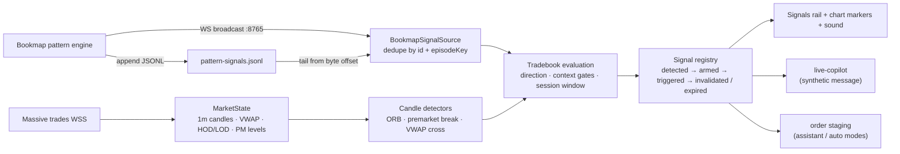
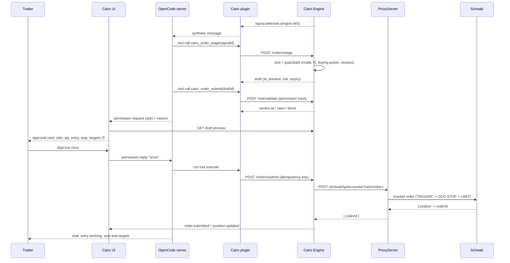
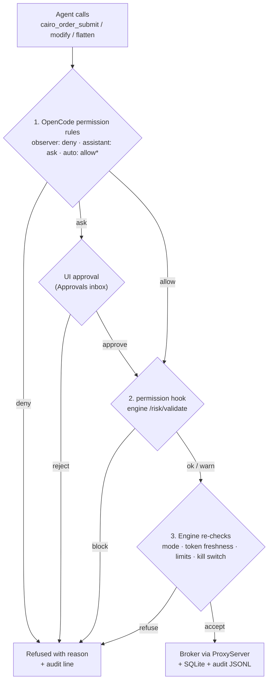
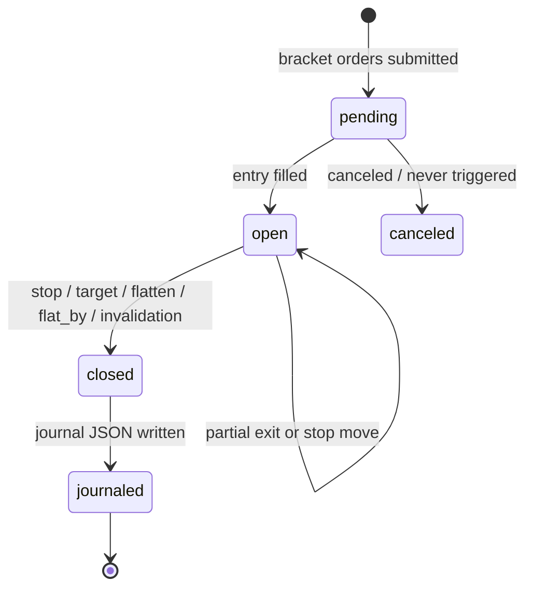
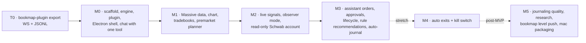

# Cairo — Architecture Diagram

Visual map of the MVP as decided in `00-decisions.md` and specified in `01-architecture.md`.
All diagrams are [Mermaid](https://mermaid.js.org/): they render on GitHub, in VS Code (Mermaid
preview), and at <https://mermaid.live> when pasted.

**Decided constraints reflected here:** one active symbol at a time · one preconfigured LLM model ·
Cairo consumes the Schwab token maintained by bmtrader (never refreshes it) · Bookmap pattern
signals exported over WS push + JSONL append.

---

## 1. System context

```mermaid
flowchart TB
  subgraph EXT["External services"]
    SG["Massive API<br/>REST + WSS"]
    SB["Schwab API"]
    LLM["OpenAI API"]
  end

  subgraph BM["Bookmap (Java addon)"]
    BME["bmtrader plugin<br/>pattern engine + trading"]
    BMS["SignalWebSocketServer :8765"]
    BMF["pattern-signals.jsonl<br/>%USERPROFILE%/Bookmap/..."]
  end

  subgraph WS["Cairo workspace — %USERPROFILE%/Cairo"]
    TB["tradebooks/*.yaml"]
    PL["plans/YYYY-MM-DD/"]
    JN["journal/YYYY-MM-DD/"]
    AG["AGENTS.md + .opencode/<br/>agents · skills · commands · plugin"]
    ST[".state/<br/>cairo.db · runtime.json · audit/ · signals/"]
  end

  subgraph APP["Cairo Desktop (Electron, Windows)"]
    subgraph REN["Renderer (React + TS)"]
      CH["Chart<br/>lightweight-charts"]
      SR["Signals rail"]
      CP["Copilot chat"]
      APV["Approvals inbox"]
      PO["Positions and orders"]
      TBP["Tradebook and plan panels"]
    end
    subgraph MAIN["Electron main (Node)"]
      LIFE["window + sidecar lifecycle"]
    end
    subgraph ENG["Cairo Engine (127.0.0.1)"]
      MKT["market<br/>Massive REST/WS to candles,<br/>VWAP, premarket levels, context"]
      SIG["signals<br/>Bookmap source + candle detectors"]
      RISK["risk + guardrails"]
      ORD["orders<br/>stage, submit, modify, cancel, flatten"]
      RUL["rules<br/>breakeven, partials, invalidation, flat-by"]
      TRD["trades + journal"]
      API["HTTP + WS API"]
    end
    subgraph OC["OpenCode sidecar (opencode-cli.exe)"]
      SESS["sessions + streaming"]
      TOOLS["cairo_* tools"]
      PERM["permissions: allow / ask / deny"]
      SKL["agents + skills + commands"]
    end
  end

  PS["ProxyServer :3000<br/>/schwabApi pass-through"]
  CRED["%USERPROFILE%/bmtrader/secrets.json<br/>read-only: Massive key + Schwab token"]

  REN <-- "HTTP + WS" --> API
  CP <-- "@opencode/client" --> SESS
  TOOLS <-- "HTTP (local token)" --> API
  MAIN --> ENG
  MAIN --> OC
  MKT <--> SG
  ORD --> PS
  PS <--> SB
  CRED -. "read fresh, never refresh" .-> MKT
  CRED -. "read fresh, never refresh" .-> ORD
  BME --> BMS
  BME --> BMF
  BMS -. "WS push (fast path)" .-> SIG
  BMF -. "JSONL tail (fallback + backfill)" .-> SIG
  API --> SR
  API --> CH
  API --> PO
  API --> TBP
  RUL --> ORD
  TRD --> JN
  AG --> OC
  TB --> ENG
  PL <--> ENG
  ENG --> ST
  SESS <--> LLM
```

---

## 2. Signal ingestion and detection

---

## 3. Assistant order flow (human approval)

---

## 4. Mode enforcement (defense in depth)

\* auto mode `allow` applies only to pre-validated management/exits; **entries always ask**.

---

## 5. Trade lifecycle

Reconciliation: on startup and periodically, the engine reads Schwab orders/fills for the day and
rebuilds `pending/open` trades — it never trusts in-memory state across restarts.

---

## 6. MVP build order (what exists when)

